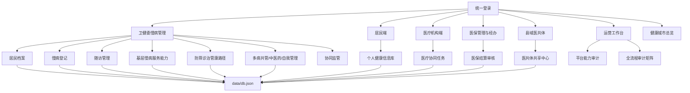

# 慢病医防融合平台结构与优化建议

更新日期：2026-06-22

当前系统已从单一慢病管理 MVP 扩展为多端卫生健康信息平台。慢病仍是核心业务线，同时已经接入县域医共体、分级诊疗、医保协同、居民端个人健康信息库和运营审计工作台。本轮已依据《关于加强基层慢性病健康管理服务的指导意见（国卫基层发〔2025〕15号）》和《基层慢性病健康管理服务能力建设指引》补齐基层慢病服务能力建设、全流程路径和质控台账。

## 1. 当前系统边界

已实现的业务端：

- 卫健委慢病管理端：居民档案、慢病登记、随访管理、统计分析、协同监管。
- 居民端：个人健康信息库、电子病历、检查检验、用药、随访、固定取药和授权共享。
- 医疗机构端：协同任务、转诊复诊、固定取药和授权档案查看。
- 医保管理与经办：医保局政策与基金监管、医保中心经办审核、区市县医保局属地监管和支付提示。
- 县域医共体端：共享中心、双向转诊、公共卫生协同、基层运营和绩效质量。
- 运营工作台：模块路线图、平台审计、全流程审计和跨端待办。

## 2. 当前结构图

## 3. 慢病闭环现状

| 环节 | 当前能力 |
|---|---|
| 建档 | 支持居民档案和健康指标维护 |
| 登记 | 支持高血压、糖尿病等慢病登记 |
| 分层 | 支持演示级风险评估和标签 |
| 随访 | 支持计划、状态、逾期识别和完成 |
| 能力建设 | 已按基层慢病健康管理中心、村卫生室/社区卫生服务站、紧密型医联体牵头医院和专业公卫机构拆分职责 |
| 条件对照 | 已将涵盖功能、服务内容、人员配置、人员能力、设备、用药、信息化和质量控制拆成可审计台账 |
| 全流程路径 | 已覆盖高风险发现、分类分级管理、多病共管、中医药服务和居民自我健康管理 |
| 多病共管 | 支持多病组合、风险、综合评估、整合方案、药师任务、随访频次和工作流复核 |
| 中医药服务 | 支持中医体质辨识、适宜技术/康复干预、服务提供方和复诊状态 |
| 自我管理 | 支持居民自测设备、上传来源、互助小组、健康积分、家庭医生复核和异常预警 |
| 用药保障 | 支持基本药物、医保目录、长期处方、库存复核、缺药登记和采购协调 |
| 质控评价 | 支持 2027 目标、当前系统证据、责任方、证据集合、核验和整改闭环 |
| 协同 | 支持医疗机构、医保、县域医共体协同视图 |
| 取药 | 支持固定取药日期、药房、医保类别和下次取药 |
| 居民查看 | 支持居民端查看档案、病历、用药和随访 |
| 审计 | 支持运营工作台查看模块缺口和全流程矩阵 |

## 4. 已完成推进点

- 医共体不再只是规划项，已形成独立 `county.html` 工作台和配套数据集合。
- 慢病流程已从大连市卫生健康委扩展到居民端、机构端、医保管理与经办和医共体端。
- 慢病 2025 政策要求已转化为 `chronicServiceRoles`、`chronicCapabilityConditions`、`chronicServicePathways`、`chronicComorbidityPlans`、`chronicTcmServices`、`chronicSelfManagement`、`chronicMedicationSupport` 和 `chronicQualityMetrics` 等集合。
- 多病共管、中医药服务、居民自我管理、用药保障和质控指标已纳入统一任务中心和 `/api/workflow-actions`，机构端与卫健委端可按权限推进，居民关联记录继续受居民授权范围约束。
- 新增慢病记录已补充单条 `PATCH` 接口，支持乐观锁、结构字段保护和审计事件写入。
- 运营工作台新增平台能力审计和全流程审计，用于持续追踪未完成项。
- README 和文档已按当前系统实际能力更新，降低后续交接成本。

## 5. 后续优先级边界

| 优先级 | 内容 | 当前状态与建议动作 |
|---|---|---|
| P0 | 真实认证和角色权限 | 本地已完成签名会话、接口级权限、角色范围、字段脱敏和审计；生产仍需接入政务统一认证、CA/短信/人脸等真实身份源。 |
| P0 | 授权共享闭环 | 本地已完成授权、撤销、过期判断、访问日志和居民访问历史复核；生产仍需接入真实居民身份和现场授权规则。 |
| P1 | 真实数据接口 | 本地已完成 HIS/EMR/LIS/PACS/医保/证照/统计契约、签名网关、幂等键、死信补偿和模拟接入；生产仍需医院、医保、公卫和家庭医生系统现场联调。 |
| P1 | 趋势与预警 | 已在居民端、卫健委端和医疗机构端展示指标趋势，并覆盖随访逾期、危急值、医保异常和数据质量预警；后续按真实模型阈值和运营质控规则调整。 |
| P1 | 基层慢病能力建设 | 已完成政策映射、服务角色、能力条件、全流程路径和质控台账；后续接入真实设备、家庭医生签约系统、药品供应链和公卫质控数据。 |
| P1 | 数据质量 | 已完成主索引、必填项、接口死信、机构信用整改、来源可信度和质量评分卡；后续接入真实人口库和院内数据质量规则。 |
| P2 | 部署生产化 | 已完成 SQLite/JSON 双路径、备份恢复演练、发布报告、CI/CD 检查和 PWA/适老化基础；生产仍需 HTTPS、正式环境密钥、审计保全、数据库原生备份和现场监控平台。 |

## 6. 下一轮建议

下一轮若仍在代码库内推进，优先做“生产切换证据深化”：把真实身份源、外部接口、审计保全、数据库原生备份和现场监控的配置项继续转化为可检查清单、演练脚本和发布证据模板。真正接入生产资源时，再按现场参数完成最终联调。
