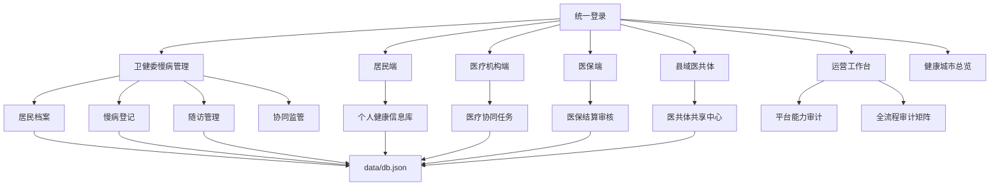

# 慢病医防融合平台结构与优化建议

更新日期：2026-06-18

当前系统已从单一慢病管理 MVP 扩展为多端卫生健康信息平台。慢病仍是核心业务线，同时已经接入县域医共体、分级诊疗、医保协同、居民端个人健康信息库和运营审计工作台。

## 1. 当前系统边界

已实现的业务端：

- 卫健委慢病管理端：居民档案、慢病登记、随访管理、统计分析、协同监管。
- 居民端：个人健康信息库、电子病历、检查检验、用药、随访、固定取药和授权共享。
- 医疗机构端：协同任务、转诊复诊、固定取药和授权档案查看。
- 医保端：慢病结算审核、控费规则、机构监管和支付提示。
- 县域医共体端：共享中心、双向转诊、公共卫生协同、基层运营和绩效质量。
- 运营工作台：模块路线图、平台审计、全流程审计和跨端待办。

## 2. 当前结构图

## 3. 慢病闭环现状

| 环节 | 当前能力 |
|---|---|
| 建档 | 支持居民档案和健康指标维护 |
| 登记 | 支持高血压、糖尿病等慢病登记 |
| 分层 | 支持演示级风险评估和标签 |
| 随访 | 支持计划、状态、逾期识别和完成 |
| 协同 | 支持医疗机构、医保、县域医共体协同视图 |
| 取药 | 支持固定取药日期、药房、医保类别和下次取药 |
| 居民查看 | 支持居民端查看档案、病历、用药和随访 |
| 审计 | 支持运营工作台查看模块缺口和全流程矩阵 |

## 4. 已完成推进点

- 医共体不再只是规划项，已形成独立 `county.html` 工作台和配套数据集合。
- 慢病流程已从卫健委端扩展到居民端、机构端、医保端和医共体端。
- 运营工作台新增平台能力审计和全流程审计，用于持续追踪未完成项。
- README 和文档已按当前系统实际能力重写，降低后续交接成本。

## 5. 仍需优先补齐

| 优先级 | 内容 | 建议动作 |
|---|---|---|
| P0 | 真实认证和角色权限 | 替换演示账号，增加接口级权限校验 |
| P0 | 授权共享闭环 | 授权、撤销、过期、访问日志和审计联动 |
| P1 | 真实数据接口 | 对接公卫、EMR、LIS/PACS、医保和家庭医生系统 |
| P1 | 趋势与预警 | 为血压、血糖、随访逾期、控费异常增加趋势图 |
| P1 | 数据质量 | 增加缺项、重复、冲突和更新时间审计 |
| P2 | 部署生产化 | 数据库、日志、备份、HTTPS、监控和 CI/CD |

## 6. 下一轮建议

下一轮优先做“授权共享 + 审计日志”的闭环。它能同时服务居民端、医疗机构端、医保端和运营工作台，也是从演示系统走向真实平台的关键基础。
