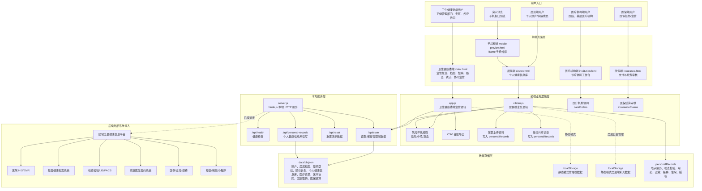
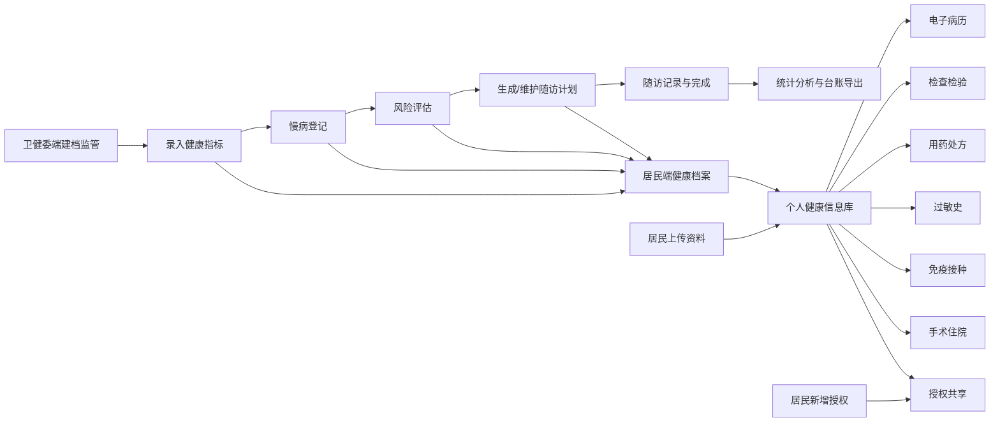
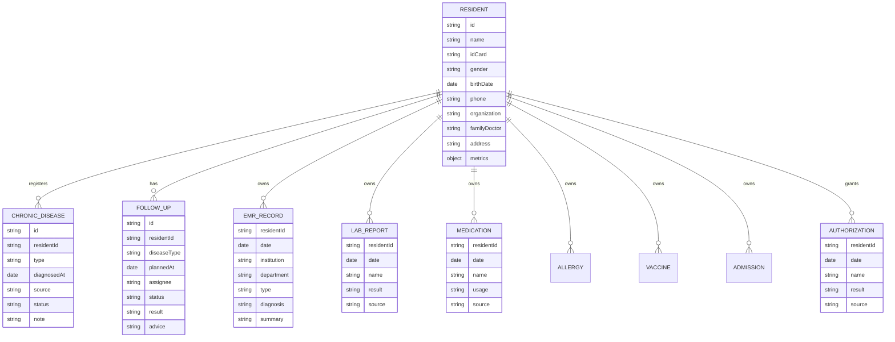

# 慢病医防融合平台系统结构图与优化建议

生成日期：2026-06-15

## 一、当前系统边界

当前系统已经形成一个本地可运行的慢病医防融合 MVP，包含三类入口：

- 卫生健康委端：面向卫健管理部门，负责监管总览、居民档案、慢病登记、随访管理、统计分析、协同监管、医疗资源监管。
- 居民端 C 端：面向居民本人，形成个人健康信息库，保留健康档案、电子病历、检查检验、用药、过敏史、免疫接种、手术住院、授权共享。
- 医疗机构端：面向医院/基层医疗机构，查看协同任务、授权档案、固定取药协同和医保贯通提示。
- 医保端：面向医保管理人员，查看慢病结算审核、基金支付、控费规则和医疗机构监管事项。
- 手机预览端：用于在电脑上模拟居民端手机视口，检查移动端体验。

## 二、当前系统结构图

## 三、业务流程图

## 四、当前数据结构关系图

## 五、审计发现

### 1. 已经比较完整的部分

- 卫生健康委端基础闭环已经形成：监管总览、建档、指标、登记、评估、随访、完成、统计、导出、协同监管。
- 协同监管页签已经形成：四端运行监测、风险预警、机构绩效、数据质量。
- 卫生健康委端已补充医疗资源监管：床位、医生、护士、慢病门诊、设备。
- 医保端已补充医疗机构监管：机构风险、审核状态、整改事项。
- 个人端已补充每月固定取药：取药日、下次取药、药房、医保类型。
- 居民端方向已经正确：从慢病页升级为个人健康信息库。
- 静态模式和服务模式都可运行，降低演示门槛。
- 手机预览已经有独立页面，便于移动端验收。

### 2. 当前主要短板

- 服务模式下数据已经统一：管理端数据、电子病历、检查检验、用药、上传资料、授权记录都可进入 `data/db.json`。
- 静态模式仍会使用浏览器 `localStorage`，这是为了保证不启动服务时也能演示。
- 居民端已具备轻量账户/家庭成员模型，但还没有真正登录认证。
- 授权共享只是记录，没有形成“授权后医生可查看什么”的权限控制。
- 风险评估规则较简单，还没有按高血压、糖尿病等病种分别建模。
- 手机端仍是 Web 响应式页面，还不是小程序或 PWA。

## 六、下一步优化优先级

| 优先级 | 优化项 | 价值 |
|---|---|---|
| P0 | 统一个人健康信息库数据模型 | 已完成：`personalRecords` 与 `/api/personal-records` |
| P0 | 增加居民端身份模型 | 已完成轻量版：个人账户/家庭成员切换 |
| P1 | 授权共享闭环 | 授权对象、授权范围、有效期、撤销授权、查看记录 |
| P1 | 电子病历详情页 | 每条病历可展开诊断、医嘱、检查、用药、来源机构 |
| P1 | 健康指标趋势图 | 血压、血糖、BMI 按时间变化展示 |
| P1 | 居民端 PWA | 手机可添加到桌面，接近 App 使用体验 |
| P2 | 风险规则引擎升级 | 按病种、年龄、指标、随访结果综合评估 |
| P2 | 数据导入导出 | 支持个人健康档案 JSON/CSV 导入导出 |
| P2 | 消息提醒 | 随访、复查、用药、授权到期提醒 |

## 七、建议下一轮实施

P0 已完成。建议下一轮优先做：

1. 授权共享闭环：已完成轻量版，支持有效期、过期提示、撤销授权。
2. GitHub 拆分部署：建议先 monorepo，再按管理端、居民端、API 拆分。
3. 真实登录认证：手机号验证码/密码登录，账户绑定居民和家属。
4. 电子病历详情页：每条病历可展开诊断、医嘱、检查、用药、来源机构。
5. 健康指标趋势图：血压、血糖、BMI 按时间变化展示。
