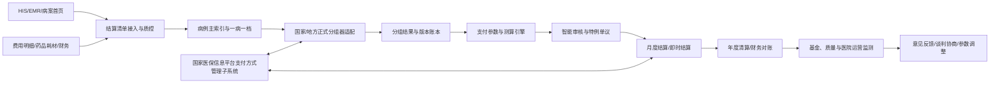

# 按病种付费系统建设规划（2026—2027）

版本：1.0  
规划日期：2026年7月14日  
适用系统：慢病医防融合管理平台 `chronic-care-platform`  
建设方式：复用现有医保经办、结算清单、工作流、审计、数据治理和发布验证能力，不重复建设国家医保信息平台已有功能。

## 一、规划结论

现有系统已经具备按病种付费的本地闭环，包括DRG/DIP分组与测算、DIP 2.0成组轨迹、特例单议、预付金、月结算与清算、监管线索、意见反馈和治理台账。下一阶段建设重点应从“功能覆盖”转向“生产可信”：

1. 以国家和地方正式分组器、支付方式管理子系统为权威来源，本平台承担业务协同、数据质控、测算解释、风险分析和证据留痕。
2. 建立医保结算清单与费用明细的唯一关联、全字段质控和版本化追溯能力。
3. 把病种分组、参数、测算、审核、结算和清算固化为可复算、可对账、可审计的账本。
4. 将监管从单一费用项目扩展为“项目+病种+病例+机构”协同监管。
5. 先完成一个统筹区、2—3家医疗机构的小范围真实数据试点，再扩大覆盖范围。

## 二、政策与技术基线

- 《医疗保障按病种付费管理暂行办法》明确总额预算、分组、权重/分值、费率/点值、特例单议、结算清算、智能监管和数据安全的完整管理框架。
- DRG/DIP 2.0版要求核心分组和DIP成组规则全国一致，地方可在统一约束下配置细分组和本地病种。
- 《医疗保障基金结算清单填写规范》要求统一数据采集标准，提高结算清单质量。
- DIP经办规程要求结算清单与医疗服务明细建立唯一标识关联，并支持基准病种、辅助目录、偏差病例、特殊病例和机构等级系数。
- 国家统一医保信息平台DRG/DIP模块属于基础约束；已有地方系统应做好分组结果和结算规则的导入衔接，不应重复建设核心平台。
- 2026年基金监管工作要求探索“一病一档”和适配DRG/DIP的单病种、多病种监管模型，重点识别高编高套、分解住院和转嫁费用。

## 三、现状与差距

| 能力域 | 当前基础 | 生产差距 | 优先级 |
|---|---|---|---|
| 病例与结算清单 | 已有病例、诊断、操作、费用和质控样例 | 缺少正式清单字段字典、唯一业务主键、费用明细关联和批量接入 | P0 |
| DRG/DIP分组 | 有双模式和DIP 2.0可解释联调规则 | 缺少正式分组器适配、规则包验签、批量分组和结果回执 | P0 |
| 参数与测算 | 有权重/分值、费率/点值和调整系数 | 缺少审批发布、双人复核、试算对比、历史重算与冻结 | P0 |
| 结算清算 | 有月度批次、对账和拨付状态 | 缺少申报截止、30个工作日SLA、财务对账、差额原因和年度清算锁账 | P0 |
| 特例单议 | 有申报和评审状态机 | 缺少材料模板、专家库、回避机制、比例按真实出院量计算和结果公示 | P1 |
| 基金监管 | 有高倍率、低倍率、分解住院等基础线索 | 缺少规则版本、诊断操作一致性、跨次住院分析、损失金额计算和核查闭环 | P0 |
| 预算与预付 | 有预算、预付金和应付未付台账 | 缺少真实基金预算分解、信用评分、预付核销和资金风险联动 | P1 |
| 医院运营 | 有机构费用和支付标准展示 | 缺少科室/医生/病种CMI、成本结构、质量结果和合理绩效边界 | P1 |
| 国家平台衔接 | 已标记外部依赖 | 缺少接口规范、联调环境、数字签名、幂等回执和补偿队列 | P0 |
| 安全审计 | 有角色权限和操作日志 | 缺少字段级脱敏、批量导出审批、正式留存期限和安全测评证据 | P0 |

## 四、目标业务架构

### 系统边界

本平台负责数据接入与质控、业务协同、可解释测算、风险分析、对账和证据留痕。正式分组规则、支付参数、基金结算和拨付结果必须来自医保主管部门或医保核心系统。本平台不得自行成为基金财务总账，也不得以本地演示分组结果替代正式分组结果。

## 五、核心产品模块

### 1. 清单接入与质控中心

- 支持医保结算清单、病案首页、费用明细、药耗明细和结算回执批量导入。
- 建立 `settlementListNo + institutionCode + dischargeDate` 幂等主键。
- 建立清单与费用明细唯一关联标识，保存原始报文、规范化报文和校验摘要。
- 质控分为格式、编码、业务、费用、时序、关联和完整性七类。
- 支持医院补正、重新提交、差异比较和质控规则版本追踪。

### 2. 分组与病种库中心

- 管理国家版、本地版、试算版和历史版DRG/DIP方案。
- 正式分组器采用适配器模式，支持同步调用、异步批量、回执查询和失败补偿。
- DIP保存主要诊断、主要操作、相关操作、10%资源阈值判断和入组轨迹。
- 支持版本切换影响分析：入组变化、权重变化、机构基金影响和重点学科影响。
- 对未入组、歧义入组和新技术病例建立人工复核队列。

### 3. 参数与支付测算中心

- 对权重/分值、费率/点值、机构系数、辅助目录和调节金进行版本管理。
- 参数必须经过草拟、试算、协商、双人复核、审批、发布、冻结和废止流程。
- 保存输入快照、公式、参数版本、分组版本、计算中间值和结果摘要。
- 支持正式测算与模拟测算隔离，模拟结果不得进入结算批次。
- 支持按医院、病种、科室分析新旧参数影响。

### 4. 特例单议中心

- 支持复杂危重症、长住院、新药耗新技术、多学科诊疗等申报类型。
- 按DRG出院病例5%、DIP出院病例5‰实时计算申报使用率。
- 建立专家库、随机抽取、利益回避、线上评审和评审意见模板。
- 支持按项目付费、提高支付标准、追加分值等结果类型。
- 按机构公开申报量、通过量、病例占比和基金支出，不公开患者身份信息。

### 5. 结算、清算和预付中心

- 月度结算记录申报截止日、受理日、审核完成日、支付日和30个工作日SLA。
- 支持即时结算回执、失败重试、差额确认和财务凭证关联。
- 年度清算支持批次冻结、机构确认、争议处理、调节金、结余留用和锁账。
- 预付金关联基金结余、风险等级、机构信用、追溯码上报和核销计划。
- 建立应付未付账龄、原因、责任人和清理结果台账。

### 6. 智能监管与一病一档

- 单病种监管：诊断操作一致性、费用结构、药耗使用、住院天数和质量结果。
- 多病种监管：同一患者短期重复住院、诊断漂移、低编/高套、费用转移。
- 机构监管：冲点数、病种结构突变、CMI异常、低倍率病例异常聚集。
- 规则输出风险等级、命中证据、建议动作和可解释原因，不直接自动认定违规。
- 核查闭环包括线索、派单、医院说明、复核、处理、追回、申诉和归档。
- 基金损失测算预留差额计算、项目比对和人工认定三种方法。

### 7. 医院运营协同

- 展示病种成本、支付标准、结余/超支、病例组合指数和结构变化。
- 联动平均住院日、再入院、并发症、低风险死亡和患者自付指标。
- 禁止把单病例支付标准直接作为医生限额或绩效分配指标。
- 绩效评价使用质量、效率、合理成本和患者获益的组合指标。

## 六、数据架构

建议从当前聚合状态对象逐步迁移为独立业务表：

| 数据对象 | 关键内容 | 保存要求 |
|---|---|---|
| `payment_cases` | 病例、患者索引、机构、住院过程 | 一例一主记录，不保存无关身份字段 |
| `settlement_lists` | 原始清单、规范化清单、质控结果 | 原文摘要与版本不可覆盖 |
| `medical_cost_items` | 项目、药品、耗材、金额和目录版本 | 与清单唯一关联 |
| `grouping_runs` | 分组请求、版本、输入摘要、结果和回执 | 支持重复运行但区分正式/模拟 |
| `payment_calculations` | 参数、公式、中间值、支付标准 | 结果冻结后只追加更正记录 |
| `special_case_reviews` | 申报、材料、专家和结果 | 专家回避与意见完整留痕 |
| `settlement_batches` | 月结算、即时结算、年度清算 | 支持财务对账和锁账 |
| `payment_audit_findings` | 规则命中、证据、核查和处理 | 线索与行政认定严格分离 |
| `payment_rule_versions` | 质控、分组、支付、监管规则 | 发布、灰度、回滚和生效日期 |
| `payment_feedbacks` | 临床、医院和社会意见 | 受理、分析、反馈和采纳状态 |

所有核心记录应具备：业务主键、版本号、来源系统、数据时间、接收时间、操作者、审计摘要和幂等键。

## 七、接口规划

### P0接口

1. HIS/EMR住院病例与病案首页。
2. 医保结算清单及费用明细。
3. 国家/地方正式分组服务。
4. 医保核心结算、清算与回执。
5. 药品耗材目录和医保目录版本。
6. 机构、科室、人员和医保区划基础字典。

### 接口控制要求

- 双向接口统一使用外部业务号和幂等键。
- 请求和回执保存摘要、时间戳、签名验证结果和重试次数。
- 敏感数据传输使用专线或合规加密通道。
- 失败事件进入补偿队列，支持自动重试、人工重放和死信处理。
- 正式和测试环境隔离，测试数据不得包含真实患者身份信息。

## 八、分阶段建设计划

### 阶段0：基线冻结与试点准备（2周）

交付物：

- 确认统筹区采用DRG或DIP、正式版本和本地参数。
- 确认2—3家试点医院及院内数据负责人。
- 完成字段字典、接口清单、责任矩阵和样例数据脱敏规则。
- 冻结现有演示能力基线，建立生产功能与演示功能隔离标识。

退出条件：业务、医保、医院、信息化四方签字确认范围和数据口径。

### 阶段1：真实清单与分组联调（6周）

交付物：

- 清单/明细批量接入、七类质控和补正闭环。
- 正式分组器适配、批量分组、回执和结果版本账本。
- 1000例以上脱敏历史病例回放。
- 新旧分组差异报告和未入组病例清单。

退出条件：清单接收成功率≥99.5%，必填字段完整率≥99%，正式分组结果一致率≥99.9%。

### 阶段2：参数测算与月度结算（8周）

交付物：

- 参数审批发布、模拟测算和影响分析。
- 月结算、30个工作日SLA、对账、回执和差额处理。
- 特例单议完整评审流程。
- 预付金、应付未付和财务对账台账。

退出条件：支付计算复算一致率100%，批次金额与医保核心对账差额为0或全部有解释。

### 阶段3：智能监管与运营分析（8周）

交付物：

- 一病一档、单病种和多病种监管模型。
- 高套低编、分解住院、转嫁费用、诊断操作不符等规则。
- 医院、科室、病种的基金、成本和质量联动分析。
- 线索核查、申诉和处理闭环。

退出条件：所有监管线索可解释、可追溯；抽样复核准确率达到试点约定目标，不以模型结果直接替代人工认定。

### 阶段4：年度清算与生产验收（6周）

交付物：

- 年度清算、调节金、结余留用、争议处理和锁账。
- 备份恢复、安全、性能、故障补偿和切换演练。
- 上线驾驶舱、值守手册、培训材料和验收证据包。
- 接入现有 `release-report`、`deploy-check`、发布清单和启动冒烟链。

退出条件：完成业务验收、接口验收、安全验收、财务对账和回退演练；外部生产依赖均有真实证据。

## 九、研发优先级与首批任务

### 第一迭代（建议立即开始）

当前状态：截至2026年7月23日，T07领域层已完成正式分组器签名契约、月结/年清状态机、在线退费（含驳回决定摘要绑定补证重提、全迁移账本阻断和事件到账务状态投影交叉验真）、特例专家回避与双审、30工作日SLA、年度资金调整以及医保/医院职责交接契约。下一步不再扩展本地演示权威，应优先由T00接入公共路由与可信回调钩子，并导入当地医保正式目录、配置现场签名证书、开展真实HTTP/专线传输、账单对账和可观测告警联调。

1. 建立正式结算清单字段模型和字段级质控规则。
2. 建立清单与费用明细的唯一关联及幂等导入接口。
3. 抽象正式分组器适配器接口，保留当前本地解释器作为模拟实现。
4. 建立 `grouping_runs` 和 `payment_calculations` 不可变结果账本。
5. 增加正式/模拟计算隔离和界面标识。
6. 增加批量病例导入、分组、错误下载和重跑功能。

### 第二迭代

1. 参数审批、双人复核、发布和回滚。
2. 月结算SLA与财务对账。
3. 特例专家库和结果公示。
4. 正式接口回执、补偿队列和死信处理。

### 第三迭代

1. 一病一档和跨次住院分析。
2. 诊断操作不符、高套低编、转嫁费用监管模型。
3. 基金损失测算辅助和核查工单。
4. 医院质量、成本、效率联动分析。

## 十、组织与资源建议

最小稳定团队建议为10—12人：

- 产品/支付政策：2人。
- 医保经办与结算专家：1—2人。
- 病案编码/临床专家：1—2人。
- 后端与数据工程：3人。
- 前端：1人。
- 测试与质量：1—2人。
- 安全、运维、数据库由平台团队共享支持。

外部固定协作角色：医保核心平台负责人、正式分组器负责人、试点医院信息科、病案室、医保办、财务科和临床代表。

## 十一、验收指标

| 维度 | 指标 |
|---|---|
| 数据 | 清单接收成功率≥99.5%；必填字段完整率≥99%；明细关联率≥99.9% |
| 分组 | 正式结果一致率≥99.9%；每例可追溯到方案和规则版本 |
| 测算 | 同输入、同版本复算一致率100%；正式/模拟结果严格隔离 |
| 结算 | 批次金额可对账；差额全部有原因；30个工作日SLA可监控 |
| 特例 | 比例自动校验；评审、回避、结果和支付调整完整留痕 |
| 监管 | 规则命中证据完整；模型线索不自动替代违规认定 |
| 性能 | 10万病例批处理在试点约定窗口内完成；失败可断点续跑 |
| 安全 | 最小权限、字段脱敏、导出审批、访问审计和备份恢复通过验收 |
| 运维 | 接口、批次、规则、队列和SLA均进入监控告警 |

## 十二、重大风险与控制

1. **误把本地分组器当成正式结算依据**：界面、接口和数据层强制区分模拟与正式结果。
2. **政策参数硬编码**：所有分组、分值、点值和系数必须版本化配置并审批发布。
3. **医院数据质量不一致**：先建立质控与补正闭环，再做支付测算和监管。
4. **监管模型误伤**：模型只生成线索，必须经过证据核查和人工认定。
5. **系统重复建设**：复用国家统一医保平台基础能力，本地仅建设必要的协同和分析能力。
6. **支付标准异化为医生限额**：绩效模块实施政策禁用控制，使用质量、效率和患者获益组合评价。
7. **主工作区在途改动较多**：继续使用独立领域文件、小范围路由挂接、专项测试和临时数据目录验证，避免影响其他模块。

## 十三、决策事项

进入阶段1前需要管理层确认：

1. 大连当前采用DRG、DIP或分区域并行的具体范围。
2. 正式分组器提供方、接口方式和联调时间窗口。
3. 首批试点医院、历史病例规模及数据出域规则。
4. 医保核心系统是否提供测试环境、结算回执和清算接口。
5. 本地权重/分值、费率/点值和机构系数的审批责任人。
6. 项目建设是医保侧系统、医院侧协同系统，还是市级平台双侧协同模式。

## 十四、参考依据

- 国家医保局：《医疗保障按病种付费管理暂行办法》，https://www.nhsa.gov.cn/art/2025/8/15/art_104_17573.html
- 国家医保局：DRG/DIP付费2.0版分组方案政策解读，https://www.nhsa.gov.cn/art/2024/7/23/art_105_13316.html
- 国家医保局：《医疗保障基金结算清单填写规范》，https://www.nhsa.gov.cn/art/2020/5/8/art_104_6483.html
- 国家医保局：《DIP医疗保障经办管理规程（试行）》，https://www.nhsa.gov.cn/art/2021/7/15/art_53_5560.html
- 国家医保局：支付方式管理子系统DRG/DIP功能模块使用衔接，https://www.nhsa.gov.cn/art/2022/4/15/art_104_8110.html
- 国家医保局：《关于做好2026年医疗保障基金监管工作的通知》，https://www.nhsa.gov.cn/art/2026/2/2/art_53_19557.html
- 国家医保局：《医疗保障基金使用监督管理条例实施细则》，https://www.nhsa.gov.cn/art/2026/2/13/art_173_19681.html
