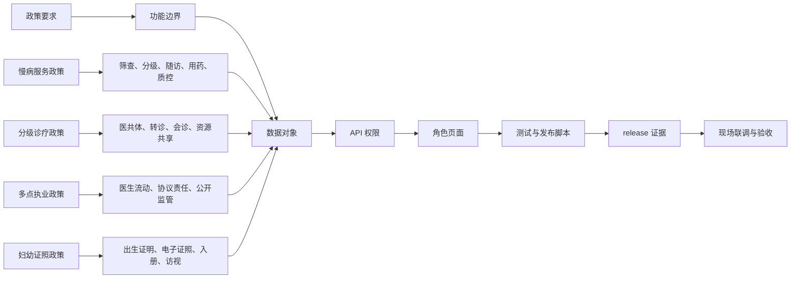

# 政策依据说明

## 文档定位

本说明用于把平台已经实现的功能与相关卫生健康政策要求对应起来。它不是生产上线批复文件，也不替代正式政策解读；它用于研发、审计、验收和发布时确认：页面、API、数据对象、测试和 release 产物是否能证明平台能力。

## 政策来源

| 政策 | 关键要求 | 平台映射 |
|---|---|---|
| 《关于加强基层慢性病健康管理服务的指导意见》（国卫基层发〔2025〕15号） | 高风险发现、分类分级管理、慢病患者自我健康管理、基层用药保障、长期处方、缺药登记配送、医保协同 | 慢病分层随访调度、筛查任务、分级管理计划、多病共管、自测预警、用药保障、固定取药、医保审核 |
| 《基层慢性病健康管理服务能力建设指引》（国卫办基层函〔2025〕439号） | 一站式基层慢病健康管理中心、功能分区、人员配置、设施设备、数智化应用、质量管理 | 慢病服务角色、能力条件、服务路径、质量指标、服务验收台账和发布摘要 |
| 《关于加快建设分级诊疗体系的若干措施》（国办发〔2026〕11号） | 以紧密型医联体完善协同机制，强化基层常见病和慢病管理，畅通转诊渠道，推进资源共享 | 县域医共体、双向转诊、远程会诊、医技互认、报告回传、基层 AI、绩效评价和居民授权 |
| 《关于印发推进和规范医师多点执业的若干意见的通知》（国卫医发〔2014〕86号） | 鼓励优质医疗资源下沉，规范多点执业申请、协议、责任保险、信息公开和监管 | 医师账户、多点执业申请、第一执业地点意见、协议责任、保险核验、公开备案和监管风险 |
| 数字健康、全民健康信息平台和互联互通测评相关要求 | 数据共享、业务协同、电子健康档案开放、接口标准、安全审计和发布取证 | 居民主索引、授权共享、区域诊疗数据共享、接口映射、集成网关、审计哈希链和 release 证据 |
| 出生医学证明、电子证照、妇幼健康管理和人口统计相关要求 | 出生证明签发、电子证照、公安共享、妇幼入册、新生儿访视、出生缺陷筛查和统计预警 | 妇幼健康全模块、出生证明登记、出生人口统计、低体重儿专案、妇幼风险清单和居民端接续清单 |

## 政策到系统能力路径

发布门禁同时要求 policy coverage 能识别 `flowchart TD` 流程图证据；本总说明保留横向 LR 主图，专项政策文档提供 TD 流程图用于逐项验收。

## 已实现证据

- 关于页：`about.html` 的 `data-about-section="policy-basis"` 展示政策说明，`multi-practice-policy` 与 `maternal-child-module` 展示专项说明。
- 慢病：`/api/chronic/risk-stratification`、`/api/service-acceptance-summary`、慢病服务角色、能力条件、路径、用药保障和质控指标。
- 医共体：`county.html`、`/api/referral-teleconsultations`、县域协同工单、互认记录、基层 AI、绩效和验收台账。
- 多点执业：`institution.html` 医师申请入口、`/api/multi-practice-registry` 公开备案和监管队列、`docs/医师多点执业政策说明.md`、`docs/医师多点执业主要功能报告.md`。
- 妇幼：`docs/妇幼健康全模块说明.md`、出生证明登记、出生人口统计、妇幼协同、居民端接续清单。
- 发布：`npm.cmd run priority-apps:templates`、`npm.cmd run health-dashboard:summary`、`npm.cmd run deploy:check`。

## 仍需现场接入

- 政务统一身份认证、CA、短信、人脸核验和医生电子化注册。
- HIS、EMR、LIS、PACS、心电、体检、处方流转和分级诊疗真实业务接口。
- 医保核心、医保电子凭证、门慢门特、双通道和异地转诊结算规则。
- 电子证照、公安户籍、民政、妇幼、疾控和统计直报系统。
- 等保、密评、信创适配、生产数据库、对象存储、日志保全和灾备演练。

## 研发约束

1. 新增模块必须在关于页补充功能说明和政策映射。
2. 新增模块必须在 `docs/` 下提供说明文档和流程图。
3. 新增模块必须暴露数据对象、API、页面入口、测试证据和验收证据。
4. 发布前必须通过 `npm.cmd run check`、`npm.cmd test`、`npm.cmd run test:e2e` 和 `npm.cmd run deploy:check`。
