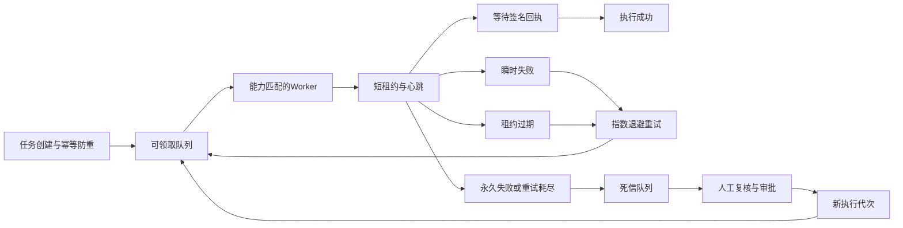

# 数智医院标准平台 v0.17 任务运行中心

## 1. 建设目标

v0.17在v0.16“环境、凭据、幂等、回执、隔离、切换”安全边界上补齐异步任务运行能力，使接入认证、数据校验和联调执行具备可调度、可恢复、可审计的统一生命周期。

本版本解决四个问题：

1. 谁领取任务：Worker必须完成登记、处于就绪状态并声明匹配的任务能力。
2. 如何识别失联：任务使用短租约，Worker通过心跳续期，租约过期后平台自动回收。
3. 失败如何恢复：瞬时失败按指数退避重试，永久失败或重试耗尽进入死信。
4. 死信如何返场：必须记录审批角色和复核说明，重放后开启新的执行代次。

## 2. 总体架构

## 3. 任务状态模型

| 状态 | 含义 | 允许动作 |
| --- | --- | --- |
| `queued` / 排队中 | 已通过幂等防重，等待Worker | 领取 |
| `running` / 执行中 | Worker持有有效短租约 | 心跳、完成本次执行、记录失败 |
| `retry-scheduled` / 等待重试 | 瞬时失败，等待下次执行时间 | 到期后重新领取 |
| `awaiting-receipt` / 等待回执 | Worker已释放租约 | 核验签名回执 |
| `succeeded` / 成功 | 回执四项核验通过 | 纳入切换门禁 |
| `blocked` / 阻断 | 安全校验失败 | 隔离与复核 |
| `dead-lettered` / 死信 | 永久失败或重试耗尽 | 审批后重放 |

## 4. Worker与租约

- Worker登记字段包括节点别名、运行池、任务能力、状态和最后心跳时间。
- Worker凭据、API密钥和私钥不得进入执行状态。
- 领取任务时生成一次性租约令牌，状态中仅保存`leaseTokenHash`。
- 心跳必须同时匹配任务、Worker和租约令牌，过期租约拒绝续期。
- 同一Worker同一时刻只能持有一个活动任务。
- 环境不健康、连接器处于隔离状态或能力不匹配时，领取请求默认拒绝。

## 5. 重试与死信

- 默认最大尝试次数为3次。
- 默认基础退避时间为30秒，采用`base × 2^(attempt-1)`计算，受最大退避时间约束。
- 网关超时、网络瞬断和Worker失联归为可重试故障。
- 契约拒绝、隐私策略拒绝等永久故障直接进入死信。
- 死信只保存任务标识、连接器、环境、任务类型、载荷摘要、错误代码、尝试次数和执行代次，不保存原始载荷。
- 死信重放要求`reviewedBy`和不少于8个字符的`reviewNote`，重放后任务代次加一。

## 6. 接口契约

| 接口 | 用途 |
| --- | --- |
| `GET/POST /api/v1/integration-execution-workers` | 查询、登记或恢复Worker |
| `POST /api/v1/integration-execution-jobs/{jobId}:claim` | 领取任务并一次性返回租约令牌 |
| `POST /api/v1/integration-execution-jobs/{jobId}:heartbeat` | 心跳续期 |
| `POST /api/v1/integration-execution-jobs/{jobId}:complete-attempt` | 释放租约并等待回执 |
| `POST /api/v1/integration-execution-jobs/{jobId}:fail` | 安排重试或进入死信 |
| `POST /api/v1/integration-execution-leases:recover-expired` | 回收过期租约 |
| `GET /api/v1/integration-dead-letters` | 查询死信 |
| `POST /api/v1/integration-dead-letters/{deadLetterId}:redrive` | 审批并重放死信 |

## 7. 安全边界

以下内容不得进入页面状态、执行数据包、日志或死信：

- 原始保险库引用和凭据；
- Worker凭据、API密钥和私钥；
- 原始幂等键；
- 原始任务载荷；
- 原始租约令牌；
- 原始回调签名与nonce。

生产实现仍需接入外部消息队列、持久化任务库、分布式锁、托管保险库、真实签名网关、统一时钟和监控告警。本版本提供可运行的领域模型、接口契约、工作台流程和安全门禁，不将浏览器状态宣称为生产任务基础设施。

## 8. 验收口径

1. Worker只能领取健康环境、未隔离连接器且能力匹配的到期任务。
2. 状态中不出现原始租约令牌、凭据、幂等键或载荷。
3. 心跳可延长租约，错误Worker或错误令牌被拒绝。
4. 瞬时失败进入指数退避，重试次数达到上限后进入死信。
5. Worker租约过期后任务可自动恢复，Worker标记失联。
6. 死信未经复核不得重放，重放后执行代次递增。
7. 页面可完成Worker恢复、任务领取、心跳、失败重试和死信重放。
8. OpenAPI、数据包Schema、领域测试和GitHub Pages页面保持同一版本口径。
