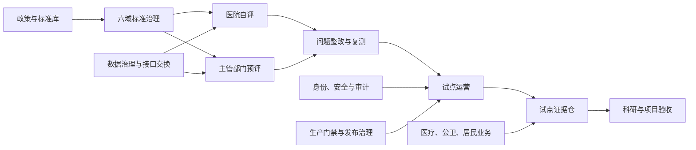

# 数智医院标准平台功能说明

版本日期：2026-07-26

适用阶段：研发汇报、项目申报、试点部署、医院预评、联合验收准备

当前定位：受控试点可运行，正式生产上线仍须完成真实接口、生产资源、安全测评、灾备演练和现场签字

## 一、平台概述

数智医院标准平台面向卫生健康主管部门、医疗机构、基层医疗卫生机构、医共体、医保协同单位、专家评价人员、项目管理人员和居民用户，建设标准统一、评价可量化、证据可追溯、整改可闭环、业务可协同、运行可审计的数智医院建设与评价支撑体系。

平台不是替代 HIS、EMR、LIS、PACS、医保核心或公共卫生直报系统的交易系统，而是承担以下职责：

1. 汇聚政策、标准、评价规则和建设任务，形成统一标准库。
2. 支撑医院自评、主管部门预评、专家复核、问题整改和复测。
3. 管理试点医院准入、实施、证据、问题、风险和阶段验收。
4. 统一数据目录、主数据、接口契约、质量规则和交换审计。
5. 汇聚医疗质量、医院运营、公共卫生、居民服务和重点应用指标。
6. 为科研项目提供标准研究、专家咨询、一致性分析和成果验收工具。
7. 通过身份、权限、审计、发布报告和生产门禁控制上线风险。

平台坚持“功能可运行、试点可运行、正式生产放行”三级状态分离。仓库内测试通过只证明软件控制可以执行，不代表医院真实数据、外部系统、生产环境或正式评价已经验收。

## 二、总体功能架构

平台由八个层次构成：

| 层次 | 主要功能 |
|---|---|
| 用户与组织层 | 卫健委、医院、基层机构、医共体、医生、护士、医保、专家、居民等角色 |
| 标准与政策层 | 政策文件、国家和行业标准、地方要求、六域标准、指标口径、版本管理 |
| 评价与试点层 | 医院自评、评价预评、专家复核、整改复测、试点运营、证据仓、科研验收 |
| 业务协同层 | 医疗质量、医院运营、慢病、公卫、转诊、影像、护理、妇幼、免疫、急救等 |
| 数据治理层 | 居民主索引、机构人员、标准字典、资产目录、数据血缘、质量规则 |
| 接口交换层 | HIS/EMR/LIS/PACS、医保、证照、公卫、统计、国家平台、消息和金融网关 |
| 安全审计层 | 统一身份、角色权限、机构隔离、访问审计、哈希链、国密与安全合规 |
| 生产保障层 | PostgreSQL、对象存储、监控告警、备份恢复、发布门禁、割接和回滚 |

核心业务关系如下：

## 三、用户角色与工作入口

### 3.1 卫生健康主管部门

主要使用平台治理、标准库、医院评价、公共卫生、综合驾驶舱、生产门禁和试点证据仓。

可实现：

- 管理标准、政策、指标和评价规则版本。
- 查看医院自评、预评结果、风险分布和整改进度。
- 建立试点批次，查看医院提交的证据和接口回执。
- 执行独立复核、退回整改、批次冻结和验收包导出。
- 查看全市医疗资源、质量安全、公共卫生和重点应用指标。
- 管理生产阻断项、责任人、完成时限和上线审批证据。
- 只读查看生产数据库、监控、接口、审计和灾备准备情况。

### 3.2 医疗机构管理人员

主要使用医院自评、试点运营、质量安全、医院运营、数据治理和接口联调功能。

可实现：

- 维护医院基础信息、建设范围和责任部门。
- 对六域标准逐项自评，上传或关联佐证材料。
- 提交整改计划、完成记录、复测申请和说明。
- 查看本机构评价差距、风险项、待办和证据完整度。
- 管理 HIS、EMR、LIS、PACS、号源等接口映射和联合测试记录。
- 建立本机构试点证据批次，关联安全对象存储附件。
- 查看本机构医疗质量、床位、人力、设备、药耗和运行指标。

### 3.3 医生、护士和业务科室

可实现：

- 医生签约、慢病筛查、风险分层、随访和转诊协同。
- 护理服务接单、上门评估、服务记录、异常上报和回访。
- 危急值确认、病历抽查、质量问题整改和复核。
- 多点执业申请、第一执业机构确认和备案管理。
- 互联网护理、陪诊、远程会诊和检查检验互认协同。

### 3.4 基层机构和县域医共体

可实现：

- 管理签约居民、慢病随访和公共卫生任务。
- 发起上转、接收下转、反馈康复和随访结果。
- 开展远程会诊、检查检验共享和报告回传。
- 查看医共体成员机构运行、资源、协同和质量指标。
- 管理县域 16255 等建设任务、问题和验收证据。

### 3.5 医保和跨部门协同角色

可实现：

- 医保待遇、门慢门特、固定取药和结算协同。
- 医保电子凭证核验和业务回执管理。
- 基金监管、异常线索、药品耗材追溯和整改闭环。
- 支付、医保、电子证照网关的签名、回调、对账和异常处置。

### 3.6 专家、评价人员和科研人员

可实现：

- 按评价任务查看脱敏材料并执行独立评分。
- 记录复核意见、退回原因和最终结论。
- 开展 Delphi 专家咨询、I-CVI、AHP、一致性和信度分析。
- 管理科研数据申请、伦理审批、脱敏、沙箱访问和成果回流。
- 对项目成果、指标和证据执行阶段验收。

### 3.7 居民和家庭成员

可实现：

- 查看个人健康档案、电子病历摘要、检查检验、处方和影像资料。
- 管理本人及授权家庭成员的档案访问。
- 预约挂号、候补、停诊改签、支付退费状态查询。
- 查看家庭医生签约、慢病随访、健康教育和用药提醒。
- 申请互联网护理、陪诊和相关便民服务。
- 查看服务进度、消息回执、评价投诉和访问记录。

居民数据按本人、家庭授权和业务必要范围裁剪，不开放管理端集合或跨机构数据。

## 四、六域标准治理

平台以六个标准域组织数智医院建设要求。

### 4.1 电子病历域

- 电子病历结构化和标准化要求。
- 病历首页、诊疗记录、医嘱、护理、检查检验和出院记录管理。
- 病历质量抽查、缺陷登记、整改和复核。
- 临床数据完整性、及时性、一致性和可追溯性检查。
- 电子病历应用水平相关建设任务和证据映射。

### 4.2 互联互通域

- 医院内部及区域平台接口目录。
- HL7、FHIR、电子健康档案、检查检验等交换契约。
- HIS、EMR、LIS、PACS、影像、号源和公共卫生接口映射。
- 消息签名、幂等、重试、死信、补偿和对账。
- 数据共享申请、用途审批、回执和访问审计。

### 4.3 智慧服务域

- 预约挂号、候补、停诊改签和就医提醒。
- 互联网医院、互联网护理、陪诊和院后服务。
- 检查检验查询、影像调阅、处方和用药服务。
- 居民健康档案、家庭授权和适老化服务。
- 服务评价、投诉、回访和满意度闭环。

### 4.4 智慧管理域

- 医疗质量、安全事件和危急值管理。
- 床位、人力、设备、门急诊和住院运行监测。
- 药品耗材、成本、医保和资源效率监管。
- 运营日报、趋势、风险预警和调度建议。
- 公立医院高质量发展、绩效考核和管理指标支撑。

### 4.5 标准服务域

- 标准库、政策库、数据元、值域和指标口径。
- 标准版本、发布状态、适用范围和变更影响。
- 机构、人员、居民、疾病、药品和检查检验主数据。
- 数据目录、服务目录和接口目录。
- 标准符合性检查、问题分派和整改重开。

### 4.6 安全合规域

- 网络安全、数据安全和个人信息保护控制。
- 等保、密评、信创、漏洞扫描和整改台账。
- 身份认证、最小权限、机构隔离和敏感字段保护。
- 数据分级分类、授权、脱敏、导出和用途审计。
- 日志留存、哈希链、WORM/对象锁和安全事件处置。

六域标准条目支持来源文件、适用机构、责任部门、检查方法、证据要求、风险等级、整改期限和版本状态等字段。

## 五、标准库和政策管理

### 5.1 标准文件库

- 登记国家法律法规、部门规章、政策文件、国家标准、行业标准和地方要求。
- 维护文件编号、名称、发布单位、发布日期、有效状态、来源链接和摘要。
- 将标准条款映射到六域、评价指标、建设任务和验收证据。
- 支持版本替换、废止、继承和影响分析。

### 5.2 指标与规则库

- 管理指标名称、定义、计算口径、单位、周期、目标值和预警阈值。
- 记录数据来源、责任部门、适用医院和证据要求。
- 支持评价规则包、医院类型和评价周期的组合。
- 支持规则校验、缺失检查、冲突检查和变更影响提示。

### 5.3 标准执行台账

- 将标准条款转化为建设任务、采集任务和整改任务。
- 记录责任人、计划日期、完成状态、证据和复核结论。
- 对过期、证据缺失、复核退回和标准变更自动形成风险项。

## 六、医院自评与评价预评

### 6.1 医院自评

- 按医院、周期、规则包建立自评任务。
- 对条款记录符合、部分符合、不符合和不适用。
- 录入说明、责任科室、完成日期和佐证材料。
- 自动计算完成度、符合率、缺口和风险等级。
- 支持保存草稿、提交审核、退回修改和重新提交。

### 6.2 数据采集

- 按接口、文档、截图、现场核查、访谈和统计指标等方式组织采集。
- 记录采集来源、时间范围、责任人、数据摘要和质量状态。
- 对缺失、过期、重复、摘要不一致和未扫描附件进行阻断。

### 6.3 评价预评

- 支持多套规则包和条款级评价。
- 按医院类型、评价范围和周期生成预评任务。
- 汇总自评结果、接口数据、证据和整改状态。
- 形成分域得分、等级判断、风险清单和改进建议。
- 明确标注预评结果不替代国家或省级正式评价。

### 6.4 专家复核

- 将评价任务分配给具备权限的评价人员。
- 防止提交人自行完成独立复核。
- 记录评分、意见、退回原因、复核时间和责任人。
- 支持多评价者结果比对和一致性分析。

### 6.5 整改与复测

- 将不符合项转为整改任务。
- 维护原因分析、措施、责任人、期限和新证据。
- 支持复测通过、继续整改和问题重开。
- 保留整改前后证据和完整操作历史。

## 七、试点运营和证据仓

### 7.1 试点机构管理

- 管理试点医院、基层机构和协同单位。
- 维护准入材料、组织架构、账号清单、网络白名单和值班表。
- 设置试点范围、阶段目标、暂停条件和退出条件。
- 管理日报、周报、问题和风险升级。

### 7.2 问题闭环

- 支持 P0、P1、P2 分级。
- 记录问题现象、影响范围、责任人、SLA 和处置过程。
- 支持确认、处理中、待复测、关闭和重开。
- 形成超时提醒、升级记录和审计历史。

### 7.3 试点证据批次

每个试点批次统一管理：

- 10 项现场任务证据。
- 4 项接口联调回执。
- 2 条生产告警路由证据。
- 4 项四方签字材料。

机构用户只能建立和查看本机构批次。卫健委角色可以跨机构查看，并承担独立复核和冻结职责。

### 7.4 证据版本与安全控制

- 证据必须关联已完成上传的安全附件。
- 校验文件名、类型、大小、SHA-256、对象版本和病毒扫描结果。
- 验收证据采用不可变保留策略。
- 新版本替代旧版本时保留全部历史。
- 每次登记、复核、退回、调阅和冻结进入哈希审计链。
- 所有写操作携带 `expectedRevision`，防止并发覆盖。

### 7.5 验收包

- 20 项证据全部通过独立复核后方可冻结。
- 冻结后生成验收包和 manifest SHA-256。
- 验收包记录证据引用、对象版本、审核人和审计链尾摘要。
- 支持导出、离线复验和篡改识别。
- 验收包不直接包含敏感附件正文。

### 7.6 PostgreSQL 证据投影

- 当前批次投影到 `pilot_evidence_batches`。
- 每个修订追加到 `pilot_evidence_batch_versions`。
- 数据库触发器拒绝版本更新和删除。
- 阻止删除整个证据集合或单个既有批次。
- 阻止冻结批次改写、版本倒退和同版本摘要冲突。
- 最低保留期为 10 年，并支持法律保全。

## 八、科研项目和标准研究

### 8.1 科研项目管理

- 管理项目基本信息、研究目标、任务、成果和里程碑。
- 建立六域标准研究任务与成果追溯关系。
- 维护项目成员、协作单位、责任分工和阶段状态。

### 8.2 成果与指标验收

- 对研究报告、标准体系、平台原型、试点方案等成果建档。
- 记录指标目标值、完成值、证据摘要和复核结论。
- 支持阶段门禁、独立复核和验收包。

### 8.3 专家咨询

- 匿名管理专家和轮次。
- 统计积极系数、权威程度、意见集中度和变异系数。
- 计算 I-CVI、S-CVI 和 AHP 一致性。
- 拒绝样本不足、全同评分等退化样本。

### 8.4 评价者一致性

- 支持 Fleiss Kappa 和 ICC(A,1)。
- 管理评价批次、案例、评价者和评分数据。
- 输出一致性结果、异常样本和复核建议。
- 对研究对象和评价者使用代号或摘要，减少个人信息暴露。

### 8.5 科研数据沙箱

- 数据集申请、伦理审批、用途限制和字段最小化。
- 脱敏检查、受控发布、沙箱访问和操作审计。
- 导出审批、结果检查和成果回流。
- 禁止未审批的生产数据直接导出。

## 九、数据治理与主数据

### 9.1 居民主索引

- 使用稳定居民索引关联不同来源记录。
- 管理身份证件、手机号、家庭和监护关系等映射。
- 支持候选匹配、冲突人工处理和变更审计。
- 避免仅依赖姓名或手机号关联健康记录。

### 9.2 机构与人员主数据

- 管理机构编码、类型、层级、区域和服务范围。
- 管理医生、护士、管理人员和执业机构关系。
- 支持第一执业机构、多点执业和账号生命周期。

### 9.3 标准字典

- 管理疾病、药品、耗材、检查、检验、手术和证照代码。
- 支持本地代码与国家、行业、医保代码映射。
- 维护版本、生效日期和停用状态。

### 9.4 数据资产和服务目录

- 登记数据集、接口、服务、责任人、敏感级别和共享状态。
- 记录来源系统、更新周期、质量状态和使用限制。
- 支持按机构、领域、系统和风险筛选。

### 9.5 数据血缘和质量

- 记录来源字段、转换规则、目标字段和责任系统。
- 配置完整性、唯一性、及时性、一致性和有效性规则。
- 形成质量评分卡、问题单、整改和复测记录。
- 关键数据摘要和版本变化可追溯。

## 十、接口集成和区域协同

### 10.1 医院核心系统连接器

覆盖 HIS、EMR、LIS、PACS、号源等接口基础能力：

- HTTPS 出站访问和安全配置。
- 请求签名、幂等键和时间戳。
- 受理回执和错误标准化。
- 短时故障有限重试。
- 永久错误停止重试。
- 死信、人工对账和补偿记录。
- 不在状态中心暴露地址、密钥或凭据。

### 10.2 区域数据共享

- 共享申请、用途审批和最小字段授权。
- 数据提供、接收、回执和撤销。
- 记录调用方、机构、目的、范围和时间。
- 对异常调用、超范围访问和过期授权形成风险事件。

### 10.3 双向转诊与远程会诊

- 发起转诊、接收评估、预约、接诊和结果反馈。
- 上转、下转、康复和随访闭环。
- 远程会诊申请、排期、意见和报告回传。
- 检查检验互认、异议和申诉处理。

### 10.4 国家全民健康数智化平台接入

- 管理接入节点、开发者凭据和接口套餐。
- 支持沙箱调用、配额、回调和调用审计。
- 健康档案索引同步与居民健康档案入口。
- 公共卫生事件发布、投递、确认和升级。
- 保持属地平台、医疗机构和居民权限边界。

### 10.5 支付、医保和证照网关

- 受控业务操作和整数分金额。
- 独立密钥签名和 HMAC 回调验签。
- 时间窗、nonce 和重放防护。
- 回调幂等、金额一致性和乱序终态保护。
- 冲正、失败补偿和摘要级日终对账。

## 十一、医疗质量与医院运营

### 11.1 医疗质量安全

- 质量事件、风险分级、调查和整改。
- 危急值发送、接收、确认和超时升级。
- 病历抽查、缺陷、整改和复核。
- 检查检验互认质量和申诉。
- 形成质量趋势、科室排名和重点风险。

### 11.2 医院运行监测

- 门急诊、住院、床位和手术运行指标。
- 人力、设备、资源负荷和异常监测。
- 日报、趋势、容量预警和调度任务。
- 责任人确认、处置反馈和交接班。

### 11.3 药品耗材监管

- 药品耗材目录、采购、使用和异常线索。
- 追溯码、批次、库存、效期和召回。
- 不合理使用、医保风险和整改任务。
- 监管证据、复核和闭环。

### 11.4 DRG/DIP 与按病种付费

- 政策依据、病组/病种规则和版本。
- 入组、费用结构、支付标准和偏差分析。
- 高倍率、低倍率、异常费用和编码风险。
- 质控、申诉、整改和监管指标。
- 当前功能用于规则落实和分析支撑，真实支付结果以医保核心系统为准。

## 十二、公共卫生和慢病协同

### 12.1 公共卫生

- 公共卫生标准域和政策要求管理。
- 风险信号、任务、事件和处置闭环。
- 传染病报告、审核、回执和超时升级。
- 死亡医学证明与死因监测。
- 突发公共卫生事件指挥和资源调度。

### 12.2 慢病医防融合

- 人群筛查和高风险识别。
- 高血压、糖尿病等风险分层。
- 管理计划、随访任务和逾期预警。
- 多病共管、中医药服务和健康教育。
- 固定取药、长期处方和用药保障。
- 家庭医生签约、基层管理和医院协同。
- 质量指标、服务验收和医保协同。

### 12.3 院前急救

- SOS、调度、车辆、急救事件和生命链。
- 最近 AED 指引和公共急救资源。
- 急诊预建档、绿色通道和院前院内衔接模型。
- 每事件证据包、摘要导出和安全复核。
- 自动 SOS 授权、撤销和误报处置。

### 12.4 血液信息

- 血液主数据、献血、检测、库存和冷链。
- 临床用血申请、交叉配血、双人复核和发血。
- 输血反应、调查、召回和机构确认。
- 紧急调配、全链条追溯和标准交换。
- 身份不一致、冷链失败和配血不合时阻断业务。

## 十三、居民服务和重点应用

### 13.1 个人健康档案

- 健康档案首页和记录分类。
- 电子病历摘要、检查检验、用药、影像和附件。
- 家庭成员、监护和授权共享。
- 访问记录、授权撤销和隐私设置。

### 13.2 预约挂号

- 科室医生排班和号源查询。
- 预约、取消、候补和停诊改签。
- 支付、退款状态和通知。
- 居民、医院和接口对账旅程。

### 13.3 互联网护理

- 服务目录、适用条件和风险提示。
- 居民申请、机构审核、护士接单和上门评估。
- 服务记录、耗材、异常事件和回访。
- 订单轨迹、质量评价和证据留存。

### 13.4 助医陪诊

- 服务申请、评估、派单和行程。
- 陪同挂号、检查、取药和报告领取。
- 服务记录、费用、异常和评价投诉。

### 13.5 妇幼健康

- 出生医学证明、撤销补正和证照交换。
- 妇幼入册、孕产妇管理和儿童保健。
- 新生儿访视和出生缺陷筛查。
- 出生、死亡和人口统计。

### 13.6 免疫规划

- 免疫程序、疫苗和接种计划。
- 应种、已种、漏种和禁忌管理。
- 接种提醒、异常反应和质量检查。
- 免疫规划 readiness 和证据报告。

### 13.7 医学影像云

- 影像检查、报告、共享和调阅。
- DICOM/Orthanc/OHIF/FHIR 连接基础。
- 影像互认、质量复核、申诉和远程诊断。
- 对象存储、安全访问和报告回传。

### 13.8 医师多点执业

- 申请、资质、第一执业机构确认和备案。
- 执业地点、期限、状态和公开信息。
- 变更、停用和监管记录。

### 13.9 体检与健康管理

- 体检套餐、预约、检查结果和总检。
- 异常指标、风险提示、随访建议和健康干预。
- 体检标准、创新亮点和 readiness 证据。

## 十四、综合驾驶舱和指标中心

### 14.1 主管部门驾驶舱

- 医疗资源、质量安全、公共卫生和服务协同总览。
- 试点机构、问题、风险、证据和上线状态。
- 指标趋势、区域比较和责任下钻。
- 数据质量、接口状态和告警状态。

### 14.2 医院管理驾驶舱

- 本机构质量、运营、资源、药耗和服务指标。
- 待办、问题、整改、接口和证据状态。
- 科室、时间和指标维度筛选。

### 14.3 指标中心

- 管理指标口径、目标、阈值、数据源和责任部门。
- 支持行业治理、高质量发展、评价和重点应用指标。
- 支持指标版本、质量状态和证据下钻。
- 预留跨域指标汇聚和专题分析能力。

## 十五、身份、安全与审计

### 15.1 统一身份

- 本地演示会话和生产 OIDC 适配基础。
- 稳定 subject 绑定、UserInfo、刷新和撤销。
- SCIM 目录预览、账号停用和会话撤销。
- 机构、人员、岗位和业务身份绑定。
- 防止自动开户、静默改绑、账号复活和最后管理员停用。

### 15.2 权限控制

- 按角色、机构、居民、家庭和业务对象裁剪。
- 页面、API 和数据范围保持一致。
- 高风险操作限定卫健委或独立复核角色。
- 越权请求拒绝并记录安全事件。

### 15.3 审计与证据

- 登录、访问、变更、复核、导出和发布操作留痕。
- 审计事件采用前后哈希形成链式校验。
- 支持留存检查、安全合规报告和审计导出。
- SIEM/Webhook 告警载荷去标识化，不发送患者标识。

### 15.4 国密与安全合规

- 国密兼容性探测、能力台账和证据包。
- 等保、密评、信创和安全整改任务。
- 真实密码设备、CA 和密钥服务未验收时不开放生产。

## 十六、生产数据库和存储

### 16.1 数据存储

- 开发和试点支持 JSON 快照与 SQLite 结构化存储。
- SQLite 具备 WAL、FULL、事务、版本和乐观锁。
- 变更通过事务 outbox 形成 PostgreSQL 影子同步批次。

### 16.2 PostgreSQL

- 基线迁移清单、敏感全量导出边界和 SHA-256 校验。
- 幂等影子同步、版本保护、失败重试和链式批次摘要。
- 只读影子核对、差异台账、责任人和自动重开。
- REPEATABLE READ 主读取演练。
- SERIALIZABLE 主写适配、全集合版本检查和无正文写审计。
- 试点证据仓领域表和不可变版本投影。
- 主服务正式切换仍需真实数据库、容量、故障切换、备份恢复和审批。

### 16.3 对象存储

- 上传意图、下载意图和生命周期意图。
- 文件类型、大小和 SHA-256 校验。
- 服务端病毒扫描和完成回执。
- 对象版本、KMS、不可变保留和对象锁契约。
- 状态中心不暴露桶名、地址或凭据。

## 十七、运行保障与发布治理

### 17.1 监控和告警

- `/api/health` 健康检查。
- 平台、数据库、接口和队列指标。
- SLO、积压、失败、延迟和新鲜度指标。
- Prometheus 文本指标。
- 告警路由、签名、重试、回执和失败闭环。

### 17.2 备份恢复和灾备

- 存储备份、清单摘要和恢复脚本。
- 回滚快照和割接前检查。
- RTO/RPO 目标和演练证据模型。
- 未完成真实恢复演练时保持上线阻断。

### 17.3 发布报告

- 汇总代码、数据、配置、身份、接口、监控、安全和业务 readiness。
- 发布报告绑定代码提交、源码树、数据快照和配置档案。
- 来源变化后旧报告失效，防止回读历史工件误判。
- 发布清单索引报告、模板、命令和证据路径。

### 17.4 生产 go/no-go

- 管理生产阻断项、责任人、证据和审批。
- 检查数据库、身份、接口、监控、备份、安全和现场材料。
- 支持上线、暂缓和驳回结论。
- 软件不得自行绕过现场审批打开生产能力。

## 十八、典型业务流程

### 18.1 医院标准自评与整改

1. 主管部门发布规则包和评价周期。
2. 医院建立自评任务并逐项填报。
3. 平台检查缺失项、证据状态和规则冲突。
4. 医院提交，评价人员开展预评和独立复核。
5. 不符合项生成整改任务。
6. 医院提交新证据并申请复测。
7. 复核通过后关闭问题，保留前后版本和审计记录。

### 18.2 试点证据验收

1. 医院建立本机构试点批次。
2. 完成现场任务、接口联调、告警演练和签字。
3. 附件进入安全对象存储并完成病毒扫描。
4. 医院按 20 项要求登记证据版本。
5. 卫健委逐项独立复核。
6. 20 项全部通过后冻结批次。
7. 导出验收包并复验 manifest SHA-256。

### 18.3 接口联调

1. 登记接口、责任系统和字段映射。
2. 配置测试环境、签名和幂等要求。
3. 发送测试报文并记录受理回执。
4. 验证成功、失败、重试、补偿和对账。
5. 归档真实回执、问题单和联合签字。
6. 接口证据纳入试点批次和生产门禁。

### 18.4 生产割接

1. 冻结代码、配置、数据快照和发布报告。
2. 完成数据库备份、迁移、校验和恢复演练。
3. 完成统一身份、外部接口、监控告警和安全检查。
4. 运行部署检查、生产配置检查和启动 smoke。
5. 四方审批后进入灰度。
6. 首日观察、问题处置和回滚准备。
7. 满足退出条件后正式放行并归档证据。

## 十九、非功能要求

### 19.1 安全性

- 全部管理 API 必须认证。
- 角色、机构和业务对象范围同时生效。
- 敏感数据最小化、脱敏和禁止日志泄露。
- 密钥只通过环境变量或密钥服务引用。
- 关键证据、审计和版本不可静默修改。

### 19.2 可靠性

- 关键写入使用事务和乐观锁。
- 外部调用具备幂等、有限重试、死信和对账。
- 生产数据库写入必须证据门控。
- 备份、恢复、回滚和灾备均需可演练。

### 19.3 可审计性

- 关键操作记录人员、时间、对象、目的和结果。
- 发布结论可追溯到代码、数据、配置和证据。
- 现场材料与软件报告使用同一试点批次管理。

### 19.4 可扩展性

- 新模块应同步建设页面、API、数据对象、权限、测试、readiness 和发布工件。
- 新外部系统优先复用签名、幂等、重试、回调和对账适配框架。
- 标准、指标、医院和评价周期均采用版本化模型。

### 19.5 可用性

- 管理端面向高频操作，支持筛选、下钻、待办和批量查看。
- 居民端支持移动预览、PWA 和适老化基础。
- 状态、错误和生产边界应清晰展示。

## 二十、外部系统接入清单

| 系统或平台 | 主要数据与业务 | 当前平台能力 | 正式上线条件 |
|---|---|---|---|
| 政务统一身份 | 用户、机构、岗位、登录退出 | OIDC/目录适配基础 | 真实凭据、映射、停用和越权测试 |
| 短信平台 | 验证码、通知、送达回执 | 签名、随机码、回调与防重放 | 真实签名、密钥、白名单和送达回执 |
| HIS | 患者、就诊、医嘱、费用、号源 | 通用连接器和契约 | 厂商协议、字段字典和联调签字 |
| EMR | 病历、诊断、手术、出院 | 通用连接器和评价映射 | 真实字段、截图、抽样和复核 |
| LIS | 检验申请和报告 | 通用连接器、互认模型 | 真实报文、字典和异常场景 |
| PACS/影像云 | 检查、影像、报告 | DICOM/OHIF/FHIR 基础 | 真实节点、对象存储和调阅验收 |
| 医保核心 | 待遇、结算、凭证、监管 | 签名网关、回调与对账 | 机构协议、密钥、沙箱和生产回执 |
| 电子证照 | 出生、死亡及其他证照 | 网关、状态和回执模型 | 证照平台协议和联合验收 |
| 公共卫生/疾控 | 传染病、死因、事件 | 事件、投递、确认和升级 | 属地口径、真实直报链路和签字 |
| 监控/SIEM | 指标、日志、告警和审计 | Prometheus、Webhook/SIEM 适配 | 真实接收端、WORM 和演练 |
| PostgreSQL | 生产业务状态和审计 | 迁移、影子同步、主读和主写适配 | 容量、备份恢复、故障切换和审批 |
| 对象存储/KMS | 附件和证据 | 意图、摘要、扫描和对象版本 | 真实桶、KMS、对象锁和恢复验收 |

## 二十一、建议试点范围

首批试点建议以“大连医科大学附属第二医院 + 卫健委主管部门”为核心，优先上线非诊疗交易类能力：

1. 六域标准库和建设任务。
2. 医院自评和主管部门预评。
3. 问题整改、复测和审计闭环。
4. 试点证据仓和验收包。
5. 科研项目任务、专家咨询和成果验收。
6. 只读数据采集、接口映射和综合驾驶舱。

首批不建议直接承载处方、收费、医保结算、医嘱执行等核心交易。核心交易应在完成真实接口、生产数据库、安全测评、灾备和四方签字后分阶段灰度。

## 二十二、当前完成状态

| 能力类别 | 当前状态 | 说明 |
|---|---|---|
| 标准库和六域治理 | 已实现 | 可开展标准维护、任务分解和符合性检查 |
| 医院自评与预评 | 已实现 | 可开展受控试点评价，不替代正式评价 |
| 整改与复测 | 已实现 | 状态、证据、复核和重开可追溯 |
| 试点运营与证据仓 | 已实现 | 20 项证据、独立复核、冻结和验收包可运行 |
| 科研验收与统计 | 已实现 | 需录入真实专家和评价样本 |
| 数据治理与接口底座 | 已实现基础 | 需真实主数据和厂商接口联调 |
| 医疗、公卫和居民业务 | 分模块可运行 | 模块成熟度不同，应按试点范围启用 |
| PostgreSQL 与对象存储 | 生产适配基础完成 | 真实资源和恢复演练尚未验收 |
| 身份、安全和审计 | 生产适配基础完成 | 真实身份源、SIEM、等保和密评待完成 |
| 监控、发布和生产门禁 | 已实现 | 真实告警、值班、灾备和四方审批待完成 |

## 二十三、正式生产放行条件

平台只有在以下条件全部满足后，方可标记正式生产就绪：

1. 生产割接清单全部通过并完成责任方签字。
2. PostgreSQL 迁移、容量、主读主写、备份恢复和故障切换通过。
3. 统一身份、短信和机构目录完成真实环境验收。
4. HIS、EMR、LIS、PACS、医保、证照和公卫关键接口取得真实回执。
5. 对象存储 KMS、病毒扫描、对象锁和恢复演练通过。
6. 监控、告警、值班升级、SIEM 和审计留存通过现场验证。
7. 等保、密评、漏洞整改、数据安全和个人信息保护材料归档。
8. 试点问题 P0 清零，P1 有明确计划和责任人。
9. 生产地址健康检查、发布报告、部署检查和启动 smoke 全部通过。
10. 卫健委、试点医院、承建方和运维/安全责任方完成正式审批。

在上述条件完成前，平台应继续以研发、演示、联合测试或受控试点口径运行。
