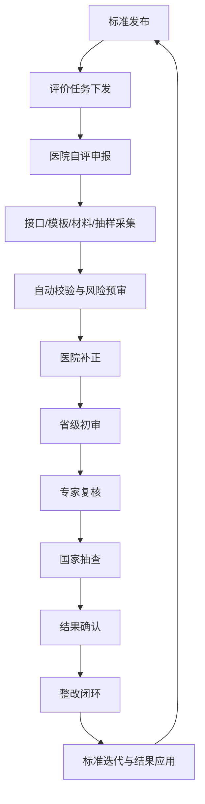

# 数智医院标准平台研发报告

## 一、研发定位

本模块是“数智医院建设与应用评价标准平台”的首个可运行切片，入口为 `digital-hospital-standards.html`。它定位为评价与治理平台，不替代医院 HIS、EMR、LIS、PACS、HRP、互联网医院或患者服务系统，也不直接承载诊疗、处方、检查检验、收费结算等业务交易。

首版目标是把顶层设计报告中的“标准中枢 + 三级平台 + N 类应用场景”落成可审计的最小闭环：

- 标准库：电子病历、互联互通、智慧服务、智慧管理、标准服务、安全合规。
- 指标映射：把既有评价体系映射到可采集、可校验、可审核、可解释的指标模型。
- 数据采集：接口采集、模板填报、材料证据、抽样核验和审计链并行。
- 分级审核：医院自评、省级初审、专家复核、国家抽查、申诉复议和整改复核。
- 安全边界：最小必要采集、脱敏汇总、权限隔离、导出审批和全程留痕。

## 二、政策与标准依据

| 依据 | 首版落地方式 |
| --- | --- |
| 国家卫生健康委《电子病历系统应用水平分级评价管理办法（试行）及评价标准（试行）》 | 建立电子病历指标继承映射，承接 EMR 功能、质量效率监测、病历闭环和临床决策支持证据。 |
| 国家卫生健康委统计信息中心《医院信息互联互通标准化成熟度测评方案》 | 将标准符合性测试、应用效果评价、交易样例、整改复测纳入证据链。 |
| 国家卫生健康委《关于进一步完善预约诊疗制度加强智慧医院建设的通知》 | 把预约诊疗、线上服务、居民端入口、消息回执、满意度和适老服务纳入智慧服务评价域。 |
| 国家卫生健康委《医院智慧管理分级评估标准体系（试行）》 | 把运营调度、资源管理、指标自动生成、业务联动和管理决策支持纳入智慧管理评价域。 |
| “十四五”全民健康信息化规划 | 把六类基础标准、元数据管理、标准应用评价和一体化评价纳入标准中枢。 |
| 网络安全法、数据安全法、个人信息保护法、GB/T 22239-2019 | 默认不汇聚患者可识别明细数据，优先采用统计指标、脱敏证据、权限隔离和审计留痕。 |

## 三、已实现功能

1. 新增可运行入口 `digital-hospital-standards.html`，并通过 `auth.js` 限定为卫健委/管理端角色访问。
2. 新增 `digital-hospital-standards.js`，内置标准域、证据包、审核队列、试点准备度和官方依据映射。
3. 页面支持按标准域、关键词和现场阻断项筛选，帮助区分已具备能力与必须现场补齐的材料。
4. 页面展示评价闭环表，覆盖标准发布、任务下发、医院自评、自动校验、分级审核和整改闭环。
5. 页面展示安全边界，明确 AI 只做预审提示，最终评价结论由授权审核主体确认。
6. 新增 `scripts/digital-hospital-standards-readiness.js`，生成 `release/digital-hospital-standards-readiness-report.json` 和 `release/digital-hospital-standards-readiness-report.md`。
7. readiness 纳入 `package.json`、CI、deploy check、release report 和 release artifact manifest。

## 四、业务闭环



## 五、数据与安全边界

- 原则上不集中采集患者姓名、身份证号、完整病历文本、影像原片等高敏感明细。
- 优先采集统计指标、标准符合性结果、脱敏样本、材料摘要和审计日志。
- 材料上传、专家查看、评分、修改、导出和结果发布全部进入审计链。
- 现场正式评价前，必须补齐等保/密评材料、真实接口联调、数据分类分级、第三方保密承诺和导出审批流程。

## 六、下一步开发计划

| 优先级 | 事项 | 验收口径 |
| --- | --- | --- |
| P0 | 指标库与规则库结构化 | 指标、数据元、证据、评分规则、版本、适用对象可被脚本校验。 |
| P0 | 医院端自评申报原型（已完成） | 医院可按任务填报、登记最小化证据引用、查看自动校验问题和补正意见。 |
| P0 | 省级初审与专家复核队列（已完成） | 审核任务可受理、争议指标可升级、专家意见可留痕，申报、初审、专家与最终接受实行独立性校验。 |
| P1 | 接口采集适配器 | HIS/EMR/LIS/PACS 等接口只上报最小必要统计指标和脱敏证据。 |
| P1 | 评价结果与整改闭环 | 结果解释、整改计划、复测和标准迭代可形成闭环证据。 |
| P2 | 试点省份与医院联调包 | 形成试点实施方案、样例报文、现场阻断项和验收签字包。 |

首版验收命令：

```powershell
npm.cmd run digital-hospital:standards-readiness
npm.cmd run deploy:check
```

## 七、运行时 API 增量

- `GET /api/digital-hospital/standards` 作为卫健委/管理端只读接口，汇总标准域、评价任务、证据包、审核队列、风险阻断项和安全边界。
- 前端通过 `HealthCityAuth.authFetch` 优先读取该接口，接口不可用时保留首版静态模型回退，便于离线演示和预览。
- 服务端种子集合包括 `digitalHospitalStandards`、`digitalHospitalEvaluationTasks`、`digitalHospitalEvidencePackets` 和 `digitalHospitalRiskItems`，并在 `deploy:check`、`release:report`、API 测试和 readiness 报告中同步纳入门禁。

## 八、上线要求与当前结论

- `GET /api/digital-hospital/launch-readiness` 输出试点上线 gate、正式生产上线阻断项、P0 要求、责任方审批和现场签字状态。
- `POST /api/digital-hospital/launch-readiness/:id/actions` 记录现场证据或签字动作，并写入 `securityEvents` 审计链。
- `GET /api/digital-hospital/production-evidence-packets` 输出正式切换证据包台账，覆盖 HIS/EMR/LIS/PACS 样例、等保密评、日志保全、回滚演练和专科案例库。
- `POST /api/digital-hospital/production-evidence-packets/:id/actions` 逐项核验证据材料，写入审计链，并在证据包完成后自动签署关联上线 requirement。
- `GET /api/digital-hospital/launch-command-briefs` 输出上线指挥简报台账，覆盖 go/no-go、首批接口回执、安全观察、回滚待命和首日收口。
- `POST /api/digital-hospital/launch-command-briefs/:id/actions` 发布或归档指挥简报，写入审计链，并回连受影响的上线 requirement。
- `GET /api/digital-hospital/formal-cutover-approvals` 输出正式割接审批台，展示 4 个独立审批角色、现场证据前置条件、签署人去重和最终授权状态。
- `POST /api/digital-hospital/formal-cutover-approvals/:id/actions` 仅在现场签署和生产证据全部完成后开放；批准动作必须提交变更单、割接窗口、唯一签署人和精确确认口令，并写入审计链。
- 当前仓库可验证结论为 `pilot-launch-ready`：标准 API、角色隔离、证据边界、试点评价任务、审批和发布门禁均可通过自动化验证。
- 正式生产上线仍保持 `blocked-until-site-materials-signed`：HIS/EMR/LIS/PACS 真实接口样例、厂商签字、等保密评、日志保全、回滚演练和专科案例库必须逐项核验并完成现场签署；材料齐备后还需 4 名不同签署人完成正式割接审批，系统才会转为 `formal-production-ready`。
- 验收命令包括 `npm.cmd run digital-hospital:standards-readiness`、`npm.cmd run launch:smoke`、`npm.cmd run deploy:check`、`npm.cmd run release:report` 和 `npm.cmd run test:coverage`。

## 九、六域规范治理增量（2026-07-16）

- 新增 `digital-hospital-governance.js`，维护法定强制、行业管理、评价参考、推荐标准、政策指导和历史规划六类规范记录。
- 将 2026 年修订后网络安全法、网络数据安全管理条例、WS/T 846/847、人工智能医疗卫生实施意见和检查检验互认要求纳入现行基线。
- 将“十四五”规划显式标记为 `historical-only`，避免被误用为 2026 年度硬性上线要求。
- 新增六域控制矩阵，打通规范文件、控制措施、责任人、证据集合、自动检查和正式上线阻断项。
- 新增规范查询和复核 API；复核必须提交结论、说明和下次复核日期，并写入不可抵赖审计链。
- 详细控制口径见 `docs/数智医院六域规范控制矩阵-2026.md`。

## 十、六域控制整改闭环（2026-07-16）

- 新增 `GET /api/digital-hospital/control-matrix`，支持按标准域、控制状态、关键词、上线阻断和逾期状态查询整改队列。
- 新增 `POST /api/digital-hospital/control-matrix/:id/actions`，支持 `assign-control`、`record-evidence`、`verify-control`、`reopen-control` 和 `mark-not-applicable` 五类动作。
- 控制证据仅登记受控引用、证据级别和可选 SHA-256 摘要，必须明确确认 `noPatientPii=true`，不得把患者可识别材料直接写入控制台账。
- 上线关键控制只接受现场或生产级证据完成“通过”复核；演示证据可用于功能验证，但不能解除正式上线阻断。
- 证据提交人与复核人必须独立，系统拒绝同一账号自提交、自复核；所有动作、状态变化、责任人和期限同时进入控制历史与 `securityEvents` 审计链。
- 条件适用控制只有在相关功能确认未启用并提供决策依据后，才可标记为“不适用”；始终适用控制不得绕过。
- 页面 `digital-hospital-standards.html` 已将只读控制矩阵升级为整改工作台，展示阻断、逾期、责任人、期限、证据数量和最新复核状态。
- 控制状态“已验证”仅表示该控制证据通过平台独立复核，不替代医院现场验收、等保/密评结论、业务科室签字或正式割接批准。

## 十一、医院自评申报与省级补正审核（2026-07-17）

- 新增 `digital-hospital-self-assessment.js`，将电子病历、互联互通、智慧服务、智慧管理、标准服务和安全合规六域细化为 12 项结构化自评指标，包含权重、依据、必填规则和自动汇总口径。
- 新增 `GET /api/digital-hospital/self-assessments`，卫健管理端查看全部任务，医疗机构账号只能查看本机构编码范围内的任务。
- 新增 `POST /api/digital-hospital/self-assessments/actions`，由卫健管理端按机构、周期、目标、责任人和期限分派自评任务；同一机构同一周期禁止重复分派。
- 新增 `POST /api/digital-hospital/self-assessments/:id/actions`，支持保存指标草稿、提交机构自评、退回补正和接受自评四类状态动作。
- 医院填报只保存结论、受控证据引用和最小化说明；必须确认 `noPatientPii=true`，符合或部分符合的指标必须登记证据引用，部分符合、不符合和不适用必须说明原因。
- 提交前自动检查 12 项必填指标和机构申报承诺；退回补正必须指定指标、意见和期限，补正后重新提交保留完整历史。
- 自评接受必须由卫健管理端独立审核，并记录审核人、结论、时间和审计事件；平台接受不替代现场抽查、正式评价结果或割接批准。
- 新增 `digital-hospital-self-assessment.html`，作为医院与管理端共用业务工作台，提供任务队列、完成率、自评分、证据引用、逐指标填报、补正审核和任务分派。

## 十二、P0-P1评价规则、采集证据与试点预评（2026-07-17）

- 新增 `digital-hospital-evaluation.js`，形成电子病历39项、智慧服务17项、智慧管理10维度、互联互通4维度，共70项条款级评价项目。
- 电子病历预评支持基本项、选择项、目标等级、前序等级、有效应用范围和数据质量指数；所有体系统一输出 `pilot-simulation` 且 `formalResult=false`。
- 新增 HIS、EMR、LIS、PACS、HRP 和支付平台六类受控采集作业，记录样本量、有效记录、质量指数、契约和回执。
- 新增评价证据中心，支持平台、受控样本、现场三级证据，强制 `noPatientPii=true`、摘要哈希和独立复核。
- 新增四体系预评和整改闭环，支持整改分派、证据补充、关闭、提交复核和独立接受。
- 新增 `digital-hospital-evaluation.html`、评价目录/试点准备度/采集/证据/预评 API，以及 `digital-hospital:pilot-readiness` 发布门禁。
- 当前功能状态为 `pilot-launch-ready`；正式状态保持 `blocked-until-site-evidence-signed`，不替代国家或省级正式评价。

## 十三、标准变更影响闭环（2026-07-23）

- 新增 `POST /api/digital-hospital/policy-register/:id/change-actions`，支持 `assess-change` 和 `activate-successor` 两类受控动作。
- 影响评估结构化保存新旧版本、官方来源、发布日期、生效日期、迁移期限、影响等级、变化摘要和受影响控制项。
- 受影响控制自动重开，旧版已接受证据转为 `superseded`，控制项进入重新取证与独立复核流程。
- 后继版本只有在全部受影响控制取得晚于评估时间的新现场或生产证据后才可启用；评估人与启用人必须分离。
- 启用后保留旧版本快照、替代文号、变更历史、控制基线和审计事件，支持追溯标准变化对六域控制和上线门禁的实际影响。
- 标准平台页面新增版本变更队列和操作表单，readiness 检查已覆盖页面、服务端路由、领域动作和前端认证请求。
