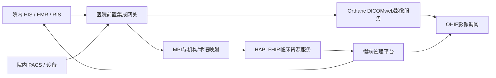

# 方案A医院信息系统对接方案

## 1. 建设定位

方案A不替换医院现有HIS、EMR、RIS或PACS。医院侧通过前置集成网关输出标准接口，平台以HAPI FHIR承载临床资源索引，以Orthanc/DICOMweb承载试点影像，以OHIF提供零安装调阅，并与现有慢病管理平台的居民档案、授权、审计和业务应用衔接。

生产影像可继续保存在院内PACS；平台按政策选择“仅索引、按需调阅”或“授权副本入云”。禁止平台直接读取医院业务数据库。

## 2. 总体链路

## 3. 接口矩阵

| 业务对象 | 推荐标准/接口 | 方向 | 关键标识 | 首期范围 |
|---|---|---|---|---|
| 患者主索引 | FHIR Patient；存量系统可由HL7 v2 ADT转换 | 医院→平台 | MPI、院内患者号、证件脱敏标识 | 必须 |
| 就诊信息 | FHIR Encounter | 医院→平台 | 就诊号、机构编码 | 建议 |
| 检查申请 | FHIR ServiceRequest | 双向 | 申请单号、Accession Number | 必须 |
| 影像索引 | FHIR ImagingStudy | 医院→平台 | StudyInstanceUID | 必须 |
| 报告与质控 | FHIR DiagnosticReport | 双向 | 报告号、StudyInstanceUID | 必须 |
| 影像像素 | DICOM C-STORE或STOW-RS；QIDO-RS/WADO-RS调阅 | 双向/按策略 | Study/Series/SOP Instance UID | 必须 |
| 结果通知 | FHIR Subscription/Webhook或院内ESB消息 | 平台→医院 | 事件ID、幂等键 | 二期 |
| 用户与授权 | OIDC/OAuth2、机构目录、RBAC/ABAC | 双向 | 用户、机构、岗位、居民授权 | 必须 |
| 审计 | FHIR AuditEvent + 平台安全日志 | 双向归集 | Trace ID、操作者、居民、目的 | 必须 |

## 4. 数据映射与幂等

- 居民以平台MPI为主键，保存院内患者号映射，不以姓名和手机号直接合并。
- 医疗机构、科室、人员使用统一社会信用代码/机构编码和平台映射表；诊断、检查、部位优先采用国家标准、ICD和LOINC，本地码保留原值。
- 影像以StudyInstanceUID全局幂等；申请以“机构编码 + Accession Number”幂等；FHIR资源使用稳定哈希ID。
- DiagnosticReport必须引用Patient与ImagingStudy；发生更正时更新版本，不覆盖审计轨迹。
- 消息统一携带`traceId`、源系统、业务时间、版本和重试次数；失败进入可重放队列。

## 5. 部署与安全边界

- 医院内网部署前置网关，位于集成区；跨域连接经医疗专网/VPN和DMZ，不开放数据库端口。
- API强制TLS 1.2+，系统间使用mTLS或OAuth2 client credentials；DICOM传输启用DICOM TLS或专网白名单。
- 凭据由密钥服务管理并定期轮换；生产关闭Orthanc匿名访问和默认账户，限制DICOMweb来源。
- 平台执行最小权限、居民授权、用途限制、字段脱敏、水印和下载控制；所有查询、调阅、导出、回写均留审计。
- 生产数据按等级保护、数据安全和个人信息保护要求完成定级、评估、备份、容灾和留存策略确认。

## 6. 实施计划

| 阶段 | 周期 | 工作内容 | 验收出口 |
|---|---:|---|---|
| 0. 现状调研 | 2周 | 系统版本、厂商接口、网络、编码、数据规模、合规边界 | 接口清单、字段字典、网络图、责任人确认 |
| 1. 测试环境 | 2–4周 | 前置网关、MPI映射、FHIR与DICOMweb联调、合成数据验证 | Patient→ImagingStudy→DiagnosticReport引用闭环 |
| 2. 单院试点 | 4–8周 | 选择1家医院、1–2个模态，完成申请、入云/索引、调阅、报告回写 | 业务闭环、异常重试、越权拒绝和审计验收 |
| 3. 生产切换 | 2–4周 | 证书、密钥、监控、备份、容灾演练、灰度和回退 | 变更审批、压测、安全测试、上线签字 |
| 4. 规模推广 | 持续 | 接入更多医院和业务系统，沉淀适配器模板 | 单院复制周期、质量和SLA持续达标 |

## 7. 验收指标

- 标准接口成功率不低于99.9%，重复消息不产生重复业务记录。
- StudyInstanceUID、Accession Number及MPI关联准确率达到试点约定目标，错配必须为零容忍人工处置项。
- 新影像索引在约定时限内可检索，OHIF调阅成功且无越权访问。
- 报告更正、网络中断、服务重启、消息重放均保留完整版本和审计链。
- 对账报表能够证明医院源记录、FHIR索引、影像对象和平台居民档案数量一致。

## 8. 首个试点建议与当前边界

首个试点建议选择一家接口配合度高的医院，以DR或CT单一模态起步：先用合成居民完成全链路，再用审批后的脱敏病例验证。院方负责源系统接口、网络与临床验收；平台方负责网关适配、MPI/FHIR/DICOMweb、监控与问题闭环；双方安全部门共同审批账号、证书和数据范围。

当前仓库已经具备合成Patient、ImagingStudy、DiagnosticReport、像素DICOM上传及OHIF调阅能力，属于可联调环境，不等于正式上线。正式生产前仍必须完成：Orthanc鉴权启用、TLS/mTLS、正式证书与密钥托管、医院Endpoint目录、院内厂商接口确认、真实网络联通、性能与安全测试、容灾演练及上线审批。
