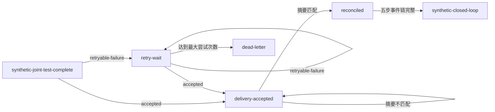

# 机构接口试点与慢病转诊闭环

## 交付边界

本增量把机构适配器、纯合成联调、失败重试、摘要对账和慢病转诊闭环编排为一个确定性状态机。它只验证平台内部契约和控制流程，不连接真实机构，不保存接口地址、凭据、患者数据或原始报文。

所有输出固定包含：

- `synthetic: true`；
- `externalEvidenceVerified: false`；
- `productionReady: false`；
- 生产门禁 `NO-GO`。

本地闭环不能替代机构双方签署的联调回执、传输签名、现场验收和独立审批。

## 首批能力

1. `chronic-referral-core` 适配器画像组合政府身份、HIS、EMR 和居民消息通道，复用现有机构集成目录。
2. 创建试点会话时复用机构集成中心，自动执行无凭据、无患者数据的纯合成正反场景。
3. 投递尝试只记录信封摘要、错误码和时间；可重试失败采用 30、60 秒指数退避，三次失败进入死信。
4. 对账比较发出信封与确认信封的 SHA-256 摘要。摘要不一致时保持 `delivery-accepted` 并标记 `reconciliation-required`，不允许进入闭环。
5. 对账匹配后，复用地区业务闭环的事件状态机完成同意、建单、接收、临床投递确认和闭环五步。事件证据是明确标注为 `artifact://synthetic/...` 的本地技术证据。
6. 所有写命令带 `commandId` 和 `expectedVersion`，支持同意图重放，并拒绝命令键冲突和并发版本冲突。

## 状态流转



`dead-letter` 和 `synthetic-closed-loop` 是当前增量的终态。死信恢复需要后续通过独立、审批受控的重放命令扩展，不能直接修改试点状态。

## 程序接口

模块 `src/platform/integration/institution-pilot-orchestrator.js` 暴露：

- `createInstitutionPilotSession`：创建适配器画像并运行纯合成联调；
- `recordInstitutionPilotAttempt`：记录接受、可重试失败或永久失败；
- `reconcileInstitutionPilot`：执行发送与确认摘要对账；
- `closeChronicReferralPilot`：生成慢病转诊纯合成闭环；
- `buildInstitutionPilotReadiness`：生成脱敏、默认拒绝生产的就绪报告。

通过以下命令查看空状态或指定状态快照的报告：

```powershell
node scripts/institution-pilot-readiness.js
node scripts/institution-pilot-readiness.js --input .\path\to\controlled-state.json
```

脚本不会写入运行时状态，也不会因本地闭环把生产门禁切换为 GO。

## 后续中央集成

T00 在统一集成时可将就绪命令登记到 `package.json`，并决定是否通过平台治理路由发布只读投影。若发布路由，必须只返回 `publicSession` 和就绪报告，不得返回尝试明细中的机构报文或任何原始业务载荷。

真实机构试点的下一阶段需要外部完成：

- 机构适配器端点与凭据引用的安全配置；
- 双方签署且可校验摘要的联调回执；
- 传输签名、幂等回执和跨进程 CAS 验证；
- 现场监控、安全评估、灾备演练和独立验收。
