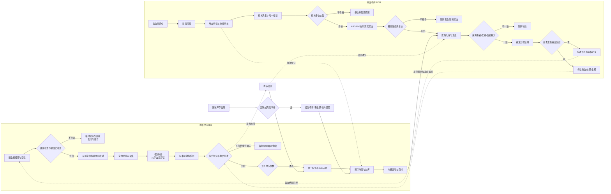
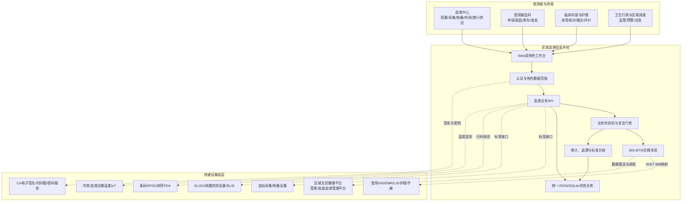
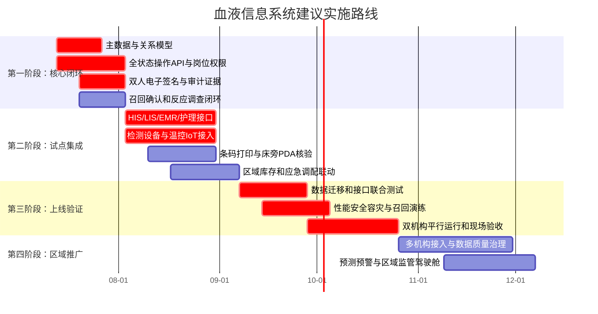

# 血液信息系统全流程审阅与下一步规划

> 审阅日期：2026-07-11
> 审阅范围：`blood.html`、`blood.js`、`blood-domain.js`、`blood-service.js`、`server.js` 血液接口、血液专项门禁与测试
> 依据：《全国血站服务体系建设发展规划（2021-2025年）》《血站信息系统基本功能标准》、WS/T 867-2025《医疗机构临床用血信息系统基本功能标准》

## 一、执行摘要

当前系统已形成面向血液中心和用血机构的区域血液协同MVP，具备双角色工作台、血液状态机、用血申请、标本拒收、库存预警、冷链门禁、双向追溯、报告收回与血液召回、输血反应上报、应急调配、角色数据范围和操作审计。专项门禁17项全部通过，专项测试15项全部通过。

系统当前成熟度建议判断为：**业务验证级MVP（可演示、可测试、可扩展），尚未达到生产上线级BIS/BTIS**。主要原因不是页面数量不足，而是尚缺真实设备和院内系统接口、完整业务操作端点、标准编码主数据、电子签名与不可抵赖审计、生产数据库与高可用、数据迁移及现场验收证据。

## 二、端到端业务流程图

### 关键安全门

1. 献血者身份、献血码、血袋和标本必须一致。
2. 待确认、不合格或疑似不合格血液必须信息隔离。
3. 检测报告未签发或未完成双人复核时禁止放行。
4. 冷链温度越限时禁止直接入库，必须隔离评估。
5. 标本身份、标签、质量或时限不符合时必须拒收。
6. 交叉配血不相合时禁止发血。
7. 床旁患者、医嘱和血袋不一致时禁止输注。
8. 检测报告收回时必须定位、冻结并召回全部关联血液。

## 三、系统拓扑图

## 四、现有实现审阅

| 层面 | 当前实现 | 审阅判断 |
|---|---|---|
| 标准覆盖 | 22项规划和标准控制映射；17项准备门禁 | 已建立标准骨架，但尚不是逐条“应/宜”全量验收矩阵 |
| 用户角色 | 血液中心和用血机构双工作台；API角色门禁 | MVP可用；仍需细分招募、采血、制备、检验、放行、输血科、护士等岗位 |
| 血液状态 | 从采集、制备、检测、放行、运输、医院接收、配血、发血、输注到评价 | 核心状态机已建立；部分状态只有规则，尚无对应操作页面/API |
| 临床用血 | 评估与同意门禁、申请创建、标本拒收、反应上报 | 基础闭环成立；申请审核、疑难配血、床旁监测和疗效评价还需持久化操作 |
| 血液安全 | 双人放行、温控、配血、床旁核对强制阻断 | 方向正确；需要电子签名、设备数据和现场扫码作为可信证据 |
| 召回追溯 | 报告收回触发血液状态召回；机构范围和审计 | 已具备发起能力；缺少医院确认、处置结果、完成判定和时限升级 |
| 应急保障 | 应急调配对象、医院申请和中心审批初始状态 | 已形成数据对象；缺少审批动作、库存锁定、配送联动和演练复盘 |
| 数据交换 | 预订、配送、交付、结局、反应、召回消息模型 | 有契约雏形；缺少WS/T 866字段级映射、幂等、签名、重试和死信处理 |
| 数据存储 | 接入平台统一JSON/SQLite状态仓库 | 适合演示与测试；生产需关系模型、事务、并发控制、备份和容灾 |
| 自动化验证 | 17/17门禁、15/15专项测试、真实HTTP冒烟 | MVP质量较好；尚缺全接口集成、端到端、性能、安全和故障演练测试 |

## 五、主要风险与缺口

### P0：上线前必须解决

1. **操作闭环不完整**：放行、交付、医院接收、配血复核、床旁输注、召回确认等核心状态仍缺完整的用户操作和API。
2. **主数据和编码不足**：献血码、血液成分、血型、检测项目、报废原因、输血反应等尚未形成统一版本化字典。
3. **真实接口缺失**：尚未接入采血设备、成分制备设备、ELISA/核酸设备、HIS/LIS/EMR/护理系统及温控设备。
4. **不可抵赖证据不足**：双人复核目前是布尔字段，未绑定两名不同人员、电子签名、时间戳和签名前数据摘要。
5. **生产数据能力不足**：需要事务型数据库、并发库存锁、唯一约束、行级权限、备份恢复和灾备验证。
6. **召回闭环未完成**：缺少医院签收、库存冻结、已输注判定、患者随访、处置完成和超时升级。

### P1：试点前应完成

1. 献血者招募、健康征询、一般检查、献血史、屏蔽解除、回访和回告的完整操作流程。
2. 血液制备规则、父子袋谱系、标签打印控制、检测批次和试剂耗材追溯。
3. 医院用血申请分级审批、特殊用血提示、疑难配血、自体输血和输血治疗。
4. 冷库库位、近效期策略、预约库存、退回再入库评估和报废审批。
5. 质量体系文件、设备、物料、环境、室内质控和室间质评台账。
6. 区域库存预测、跨机构调配、应急储备和应急演练复盘。

### P2：规模化建设

1. 国家、省、区域血液平台数据报送和跨区域调剂。
2. 供需预测、献血者精准招募和偏型短缺预警。
3. 血液质量风险监测、输血反应信号检测和管理驾驶舱。
4. 多中心标准一致性、接口版本治理和数据质量评分。

## 六、下一步建设路线图

## 七、建议的下一开发迭代

下一迭代建议聚焦一个可验收目标：**完成“一袋血从检测合格到患者输注”的生产级事务闭环**。

具体范围：

1. 建立血液单元、血液成分谱系、检测报告、库存位置、配送单、交付单、配血记录、输注记录的关系模型。
2. 实现“检测报告签发 → 两名不同人员放行 → 库存锁定 → 配送交付 → 医院扫码接收 → 配血双人复核 → 床旁三方核对 → 输注监测 → 疗效评价”全部操作API。
3. 每次操作生成操作者、岗位、机构、时间、前后状态、业务数据摘要和签名证据。
4. 建立并发库存锁和幂等键，防止同一血袋重复放行、重复发血或重复输注。
5. 增加端到端测试：正常路径、检测收回、冷链越限、配血不合、身份不一致、输血反应和紧急调配七类场景。

完成这一迭代后，系统才会从“具备核心规则的区域协同MVP”进入“可开展双机构试点联调”的阶段。
