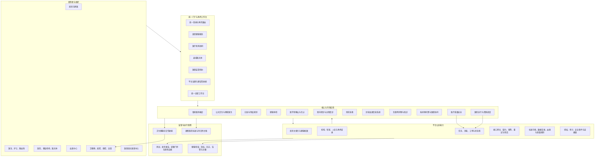
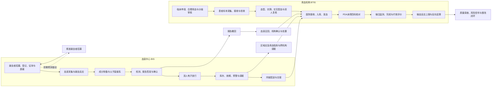
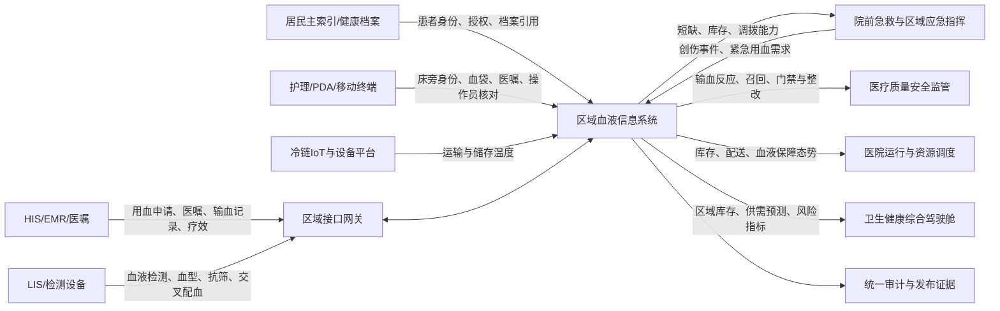
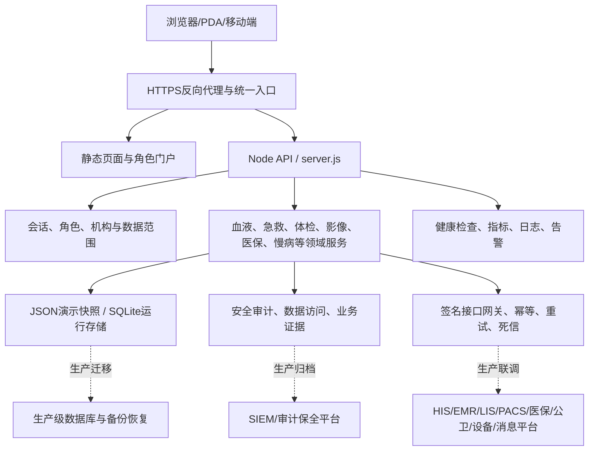

# 血液信息系统与全民健康信息平台模块关系审阅

更新日期：2026-07-17

## 一、审阅结论

当前系统已经形成统一入口、统一身份、共享数据、专项业务、监管运营和发布保障六层架构。血液信息系统不是孤立应用：它以血液中心 BIS 与医院 BTIS 为核心，经机构目录、患者主索引、HIS/EMR/LIS、护理/PDA、冷链 IoT、应急调度、质量安全和综合驾驶舱接入全民健康信息平台。

血液系统的软件闭环已覆盖献血者、采集、制备、检测、放行、库存、配送、医院接收、用血申请、标本、配血、床旁输注、疗效评价、输血反应、报告撤回、血液召回、应急调拨和质量证据。13项创新能力已有统一服务与工作台。正式运行仍取决于真实接口、设备、生产身份、主数据、数据迁移、监控灾备和现场签字证据。

## 二、整个健康系统模块关系

## 三、血液系统内部全流程

## 四、血液系统与其他模块的关系

## 五、技术拓扑与数据边界

## 六、模块责任与核心交换数据

| 模块 | 核心责任 | 与血液系统交换的主要数据 |
|---|---|---|
| 居民主索引与健康档案 | 跨机构患者身份、授权和档案聚合 | 患者标识、住院号、输血史、反应史、授权记录 |
| 医疗机构/HIS/EMR | 医嘱、临床过程、病历与疗效 | 用血申请、诊断、指征、同意书、输血记录、疗效评价 |
| LIS与检测设备 | 检验申请、标本和结果 | 血液筛查、血型、抗体筛查、交叉配血、报告撤回 |
| 护理与PDA | 床旁执行和患者安全 | 患者码、医嘱码、血袋码、操作员、生命体征 |
| 院前急救 | 急危重症事件和院前院内衔接 | 创伤/大出血事件、预计用血、接诊医院、应急调拨 |
| 质量安全 | 不良事件、整改和复核 | 输血反应、近失事件、召回、冷链异常、整改证据 |
| 医院运营 | 床位、急诊、库存和资源统筹 | 血型库存、在途量、保障天数、短缺预警、配送时效 |
| 综合驾驶舱 | 区域态势、监管和决策 | 供需预测、机构库存、风险信号、召回和应急指标 |
| 接口网关 | 外部系统契约与可靠传输 | WS/T 866/867映射、消息ID、签名、幂等、死信与回执 |
| 发布运维 | 上线门禁和持续运行 | 测试报告、接口证据、监控、灾备、现场签字和回滚材料 |

## 七、审阅发现

### 已形成的系统能力

1. 血液中心与用血机构双侧业务域、角色数据范围及关键操作权限已经分离。
2. “一袋血”状态机和检测签发、双人放行、库存锁定、配送、接收、配血、床旁核对、输注评价已形成可执行链路。
3. 冷链越限、标本不合格、配血不相容、患者身份不一致等情况能够阻断业务并留痕。
4. 报告撤回、召回确认、输血反应调查和区域应急调拨已进入闭环流程。
5. 13项创新能力已纳入统一工作台，并有专项测试及发布就绪检查。
6. 平台公共的身份、机构、工作流、接口网关、审计、数据治理和发布门禁可以被血液模块复用。

### 结构性风险

1. 当前后端仍以大型 `server.js` 聚合大量业务路由，领域服务虽已拆分，但路由、存储和跨域事件仍需要进一步模块化。
2. 血液业务与居民主索引、急救、质量安全和综合驾驶舱的逻辑关系已经明确，但部分仍是同库聚合或样例契约，尚非生产事件总线。
3. 静态预览不能证明登录会话、API写入、设备接入、审计归档和跨机构事务可用；正式运行必须部署Node后端。
4. JSON/SQLite适合演示与小规模运行验证，不应直接等同于区域生产数据库架构。
5. 预测和合理用血当前属于规则与基础计算引擎，正式临床应用需要历史数据训练、规则委员会批准、版本管理和效果监测。
6. 血液中心、医院、急救、IoT和监管端尚需用真实主数据统一机构、人员、设备、血液品种和状态字典。

## 八、建议的下一阶段架构

1. 将血液系统路由、持久化和领域事件从 `server.js` 进一步拆成独立模块，保留统一认证与审计中间件。
2. 建立以血袋、用血申请、患者、召回和应急事件为核心的事件契约，供急救、质控、运营和驾驶舱订阅。
3. 以 PostgreSQL 为交易主库，对象存储保存报告和签字附件，缓存/消息队列承担库存热点和可靠事件投递。
4. 完成真实 HIS/EMR/LIS/PDA/IoT 最小联调闭环，并将回执、对账、失败补偿纳入现有集成工作台。
5. 将标准符合性扫描从代码关键字检查升级为“业务数据证据 + 接口回执 + 现场附件 + 责任人签字”的联合门禁。
6. 保持 `functionalState` 与 `formalGoLiveState` 分离：软件功能完成不自动代表生产上线完成。

## 九、总体判断

当前平台已达到“跨角色、跨模块、可运行、可验证的综合健康信息平台原型/实施底座”水平。血液信息系统在业务完整性和安全门禁方面已经成为较成熟的专项域，但整个健康系统距离正式区域生产运行的主要差距已从页面和业务功能，转向真实系统集成、生产数据基础设施、安全合规、运行保障及多方验收证据。
