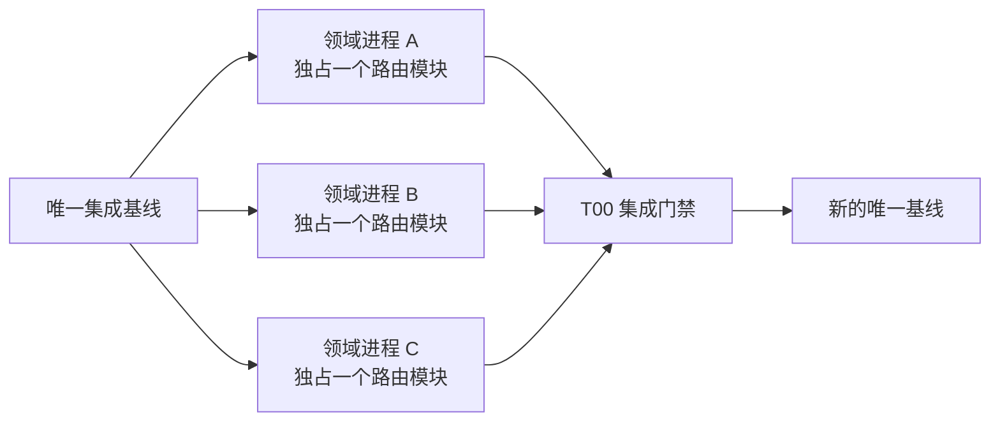

# 路由模块化与并行开发边界（2026-08-03）

## 1. 目标与唯一基线

平台只维护一个集成入口：

- 唯一集成分支：`codex/governance-integration-20260803`
- 拆分前恢复点：`baseline/governance-20260803-pre-routing`
- 路由顺序清单：`src/http/routes/index.js`
- 服务依赖装配：`server.js`

业务进程从唯一基线创建短生命周期功能分支和独立 worktree。功能分支不是第二条集成线；完成专项验证后，由 T00 按顺序合入唯一集成分支。



## 2. 运行时结构

一次 API 请求的固定调用链为：

```text
server.js
  -> 会话水合与公共错误边界
  -> createPlatformApiRouter(runtime)
  -> src/http/routes/index.js 按 ROUTE_ORDER 调度
  -> 一个领域路由段返回 true 或写入响应后立即停止
  -> 全部未处理时统一返回 404
```

`ROUTE_ORDER` 保留拆分前的实际判断顺序。领域文件在物理上分开，但不得自行改变跨领域优先级。

## 3. 进程所有权

| 进程 | 独占路由文件 | 主要范围 |
| --- | --- | --- |
| T00 集成治理 | `server.js`、`src/http/api-router.js`、`src/http/routes/index.js`、`src/http/runtime-source.js` | 依赖装配、全局顺序、公共协议、合入与发布门禁 |
| T01 运行与身份安全 | `runtime.js`、`identity-security.js` | 存活/健康/指标、认证授权、会话与安全边界 |
| T02 平台与状态治理 | `platform-governance.js`、`state-data.js` | 平台治理、审计、发布状态、通用状态读写 |
| T03 公共卫生 | `public-health.js` | 公卫协同、监测、报送、外部交换 |
| T04 居民与慢病 | `citizen-chronic.js` | 居民档案、家庭授权、慢病管理 |
| T05 服务协同 | `care-coordination.js` | 预约、转诊、护理、陪诊、协同工单 |
| T06 临床专科 | `clinical-specialties.js` | 急救、用血、影像、体检及专科能力 |
| T07 医保支付 | `insurance-payment.js` | 医保、支付、证照及金融回调 |
| T08 外部集成 | `integration.js` | HIS/EMR/LIS/PACS、网关事件和互认交换 |
| T09 科研与共享 | `research.js`、`shared.js` | 科研沙箱；确实跨领域且无法下沉的公共路由 |

`shared.js` 不是临时堆放区。新增路由优先进入明确的业务领域；只有请求语义真实跨域时才由 T00 审核进入共享模块。

## 4. 并行开发规则

1. 每个进程只修改自己独占的路由文件以及对应领域服务、测试和文档。
2. 领域进程不得直接修改 `ROUTE_ORDER`、路由器、服务依赖装配或生产打包清单；需要新增依赖或调整跨域顺序时，在交付说明中列出，由 T00 集中处理。
3. 不在 `server.js` 中新增领域路由。新路由必须进入所属领域的 `createRouteSegments(runtime)`。
4. 一个路由段只有在完成响应时返回 `true`；未命中必须自然结束或返回 `false`。禁止写出响应后继续落入后续领域。
5. 同一路由文件同一时间只有一个写入责任人。跨领域功能拆成多个独立提交，按依赖顺序合入。
6. 领域代码不得用“读取 `server.js` 文本”判断 API 是否存在；使用 `readRuntimeSource(root)`。
7. 不以删除测试、放宽检查或伪造现场证据解决集成冲突。

## 5. 分支与合入流程

```text
从唯一基线创建 feature/<process>-<topic>
  -> 在独立 worktree 完成领域实现
  -> npm run routes:check
  -> npm run routes:test
  -> 运行所属领域专项测试
  -> 提交单一职责变更
  -> T00 在唯一集成分支审查并按依赖顺序合入
  -> npm run check
  -> npm test
  -> npm run test:all
  -> npm run deploy:check
  -> npm run release:report
  -> 标记新的受保护基线
```

合入前交付说明至少包含：基线提交、修改文件、路由标识、运行时新增依赖、测试命令与结果、数据迁移影响、外部现场阻断项。

## 6. 变更场景判定

| 变更 | 领域进程可直接完成 | 必须交由 T00 |
| --- | --- | --- |
| 在既有路由段内增加同领域端点 | 是 | 否 |
| 新增同领域服务与专项测试 | 是 | 否 |
| 新增路由段但不改变跨域优先级 | 先实现并声明 | 登记 `ROUTE_ORDER` |
| 调整两个领域的先后顺序 | 否 | 是 |
| 增加或更名运行时依赖 | 领域侧提出 | 修改 `server.js` 装配 |
| 修改统一认证、错误格式或审计协议 | 否 | 是 |
| 修改部署制品、完整性校验或发布门禁 | 否 | 是 |

## 7. 验收标准

- 71 个路由段标识唯一，12 个领域完整登记。
- 顺序调度与响应短路契约测试通过。
- 完整 API 回归通过，未出现鉴权、作用域、幂等、审计和持久化语义退化。
- 生产制品包含 `src/http` 全部运行时文件并通过摘要校验。
- 集成分支工作树干净，最终提交有唯一保护标签。
- 生产 Go/No-Go 继续服从真实环境和现场证据，不因代码模块化自动转为 Go。
