# 院前急救系统拓扑与流程图集

> 与 `emergency-service.js` 的状态机、`/api/emergency/*` 接口和急救上线门禁同步维护。

## 1. 业务全景拓扑

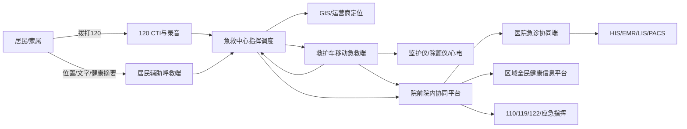

## 2. 逻辑架构

```mermaid
flowchart TB
  subgraph Access[访问层]
    A1[居民端] A2[120调度端] A3[车载端] A4[医院端] A5[监管质控端]
  end
  subgraph Gateway[接入与安全层]
    G1[统一身份与岗位授权] G2[API网关] G3[设备接入网关] G4[音视频网关] G5[审计与电子签名]
  end
  subgraph Domain[急救领域层]
    D1[呼叫受理] D2[调度任务] D3[车辆资源] D4[患者身份] D5[院前病历] D6[医院协同] D7[电子交接] D8[质控分析]
  end
  subgraph Platform[平台能力层]
    P1[居民主索引] P2[机构人员主数据] P3[可靠事件总线] P4[对象存储] P5[时序数据] P6[消息中心]
  end
  Access --> Gateway --> Domain --> Platform
```

## 3. 生产部署拓扑

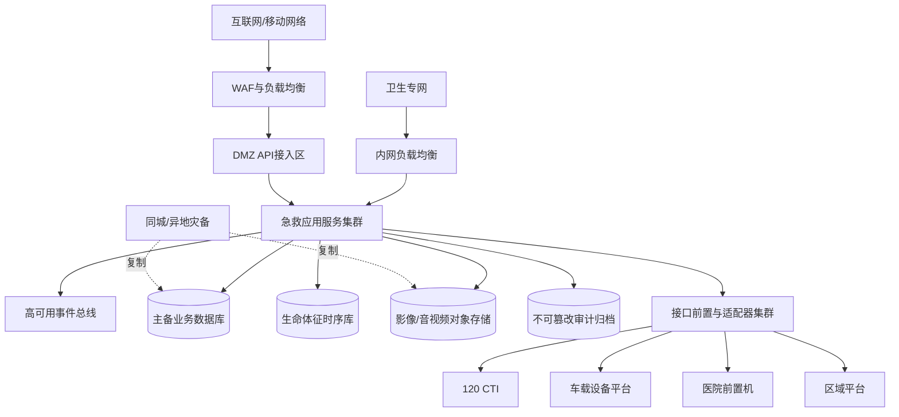

## 4. 网络与安全域拓扑

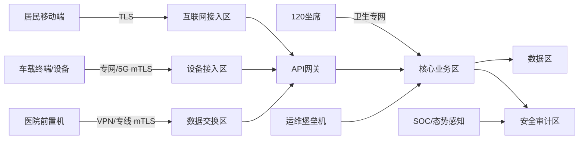

## 5. 数据交换拓扑

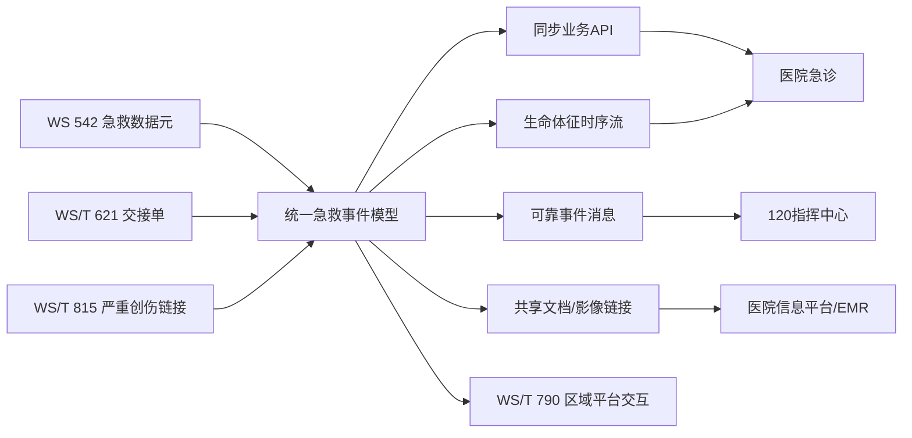

## 6. 呼救与调度泳道

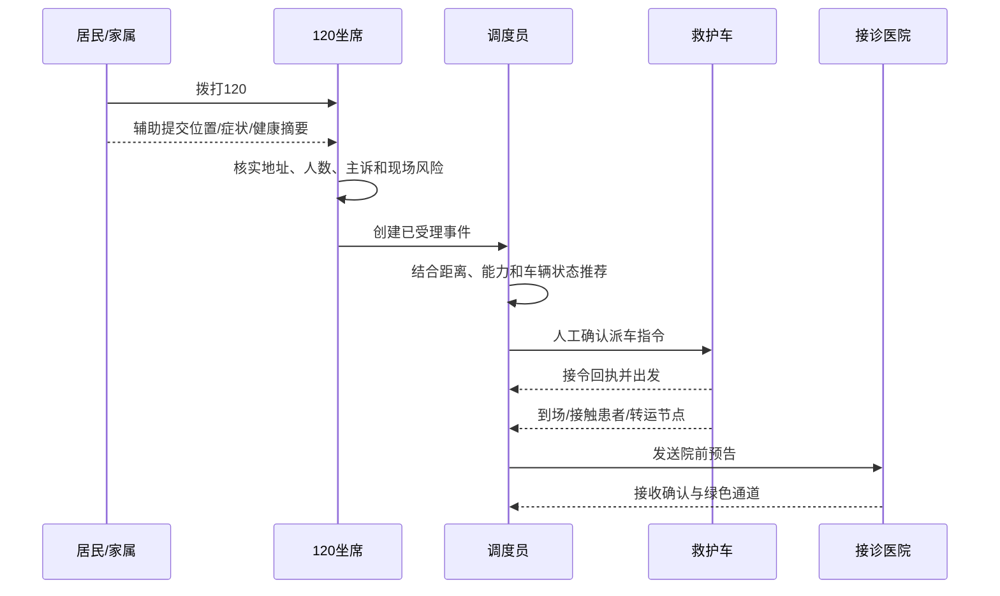

## 7. 车载救治与医院预接诊

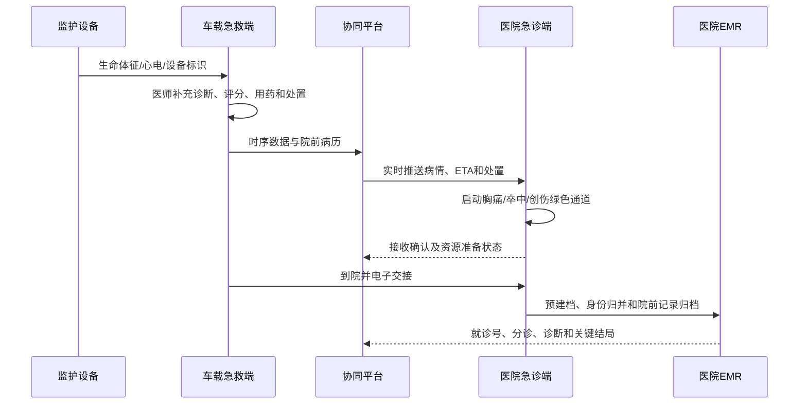

## 8. 急救事件状态机

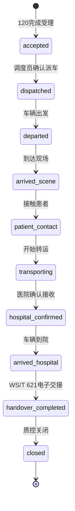

## 9. 患者身份归并流程

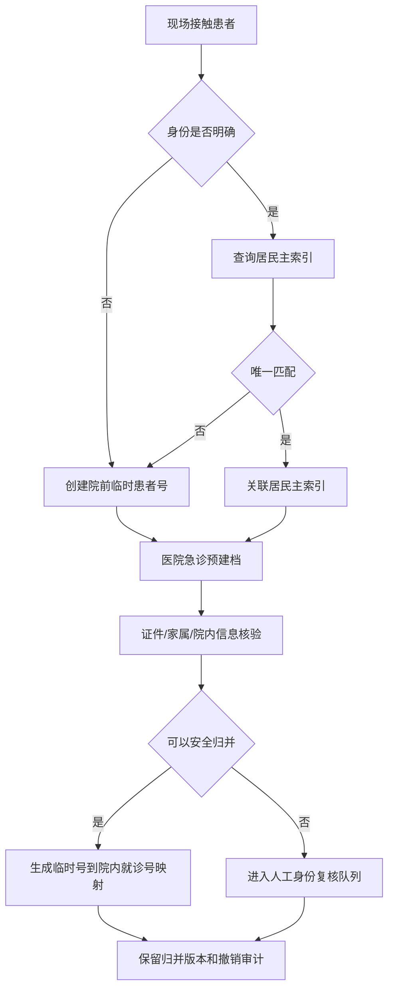

## 10. 弱网与故障降级流程

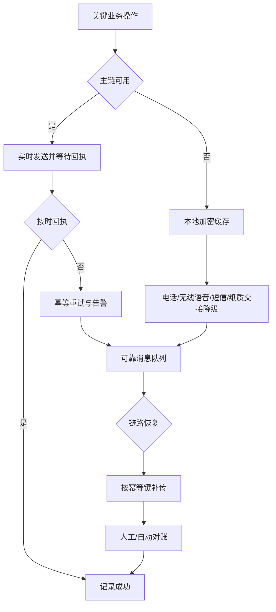

## 11. 数据安全与紧急访问流程

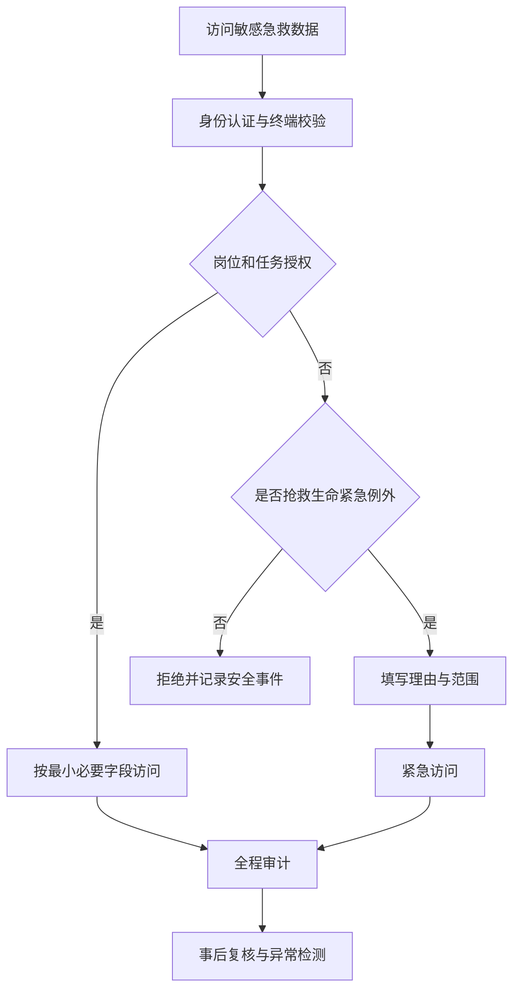

## 12. 上线与切换流程

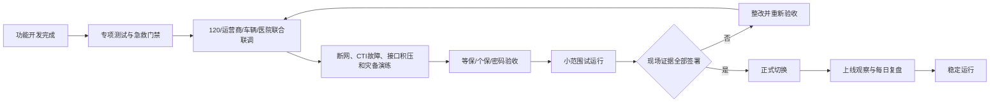

## 13. 监控告警链路

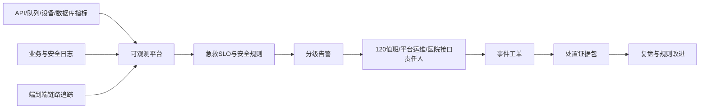
